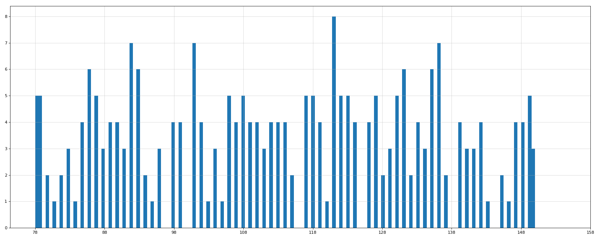
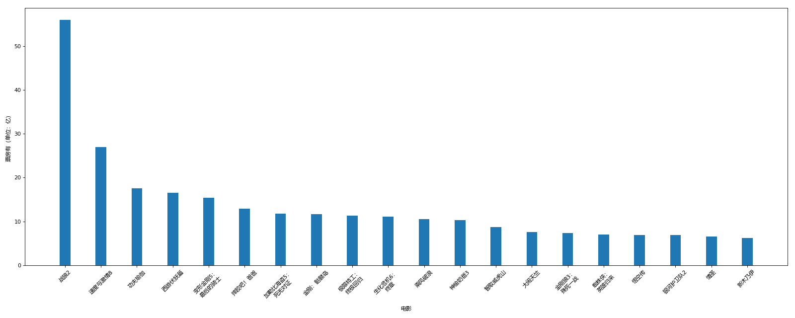

[TOC]

```python
pip install -U pip setuptools

pip install matplotlib

pip install Numpy
```

[TOC]

axis $\rightleftharpoons​$ 轴


------


------


------


## 格式化绘图的样式


### 提前引用 numpy


## 用关键字字符串绘图

------

[TOC]

# 黑马


## 图片大小、清晰度；轴刻度；保存


## 调整 X 轴的刻度格式；刻度旋转


## 显示汉字


## 添加描述信息


------


## 绘制网格，透明度


## 在同一个表里绘制


## 添加图例


## 颜色；名字；线形；透明度


## 对比常用统计图

- 折线

能够显示数据的**变化**趋势，反映事物的变化情况。

- 直方

绘制**连续**的数据，展示一组或多组数据的**分布**情况。

### 把数据分成多少组进行统计？

$组数=\frac{极差}{组距}=\frac{Max - Min}{Bin Width}​$




==和课程给出的图形不太一样，不知为何==

- 条形图

绘制**离散**的数据，轻松**比较**数据差异。





- 散点图

**判断**变量之间是否存在**数量关系**趋势，展示**离群点**。


## baidu echarts

<ul>
    <li><a href='https://echarts.baidu.com/'>echarts</a></li>
</ul>

## plotly

<ul>
    <li><a href='https://plot.ly/python/'>plotly</a></li>
</ul>

类似于 Github
