# Numpy

处理数值型数据

## eye

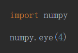

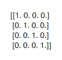

------

## array

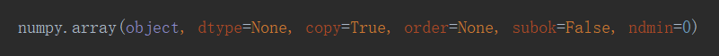

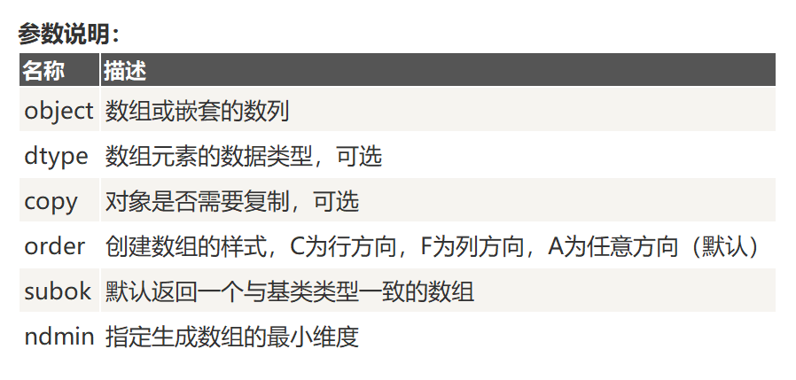

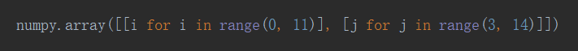

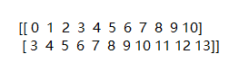

### ndmin

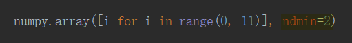

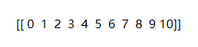

### dtype

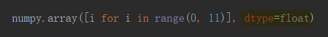

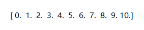

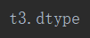

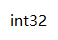

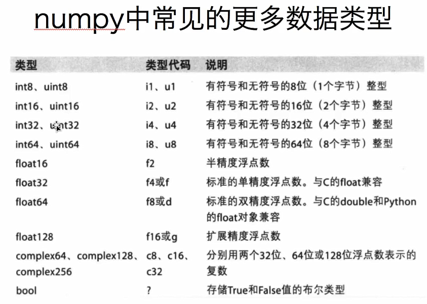

#### 调整数据类型

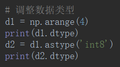

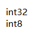

### 取小数

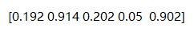

## ndarray_obj 属性

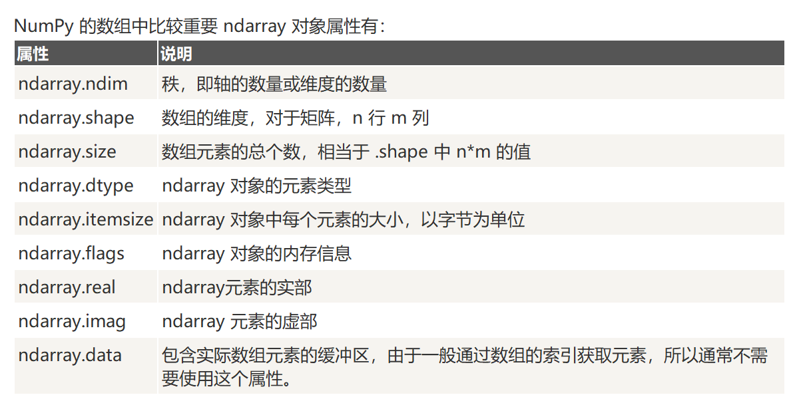

### 【返回值】.ndmi

ndmi $\rightleftharpoons$ 秩

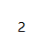

### 【返回值】.shape

shape $\rightleftharpoons$ 形状

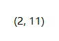

## arange

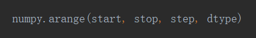

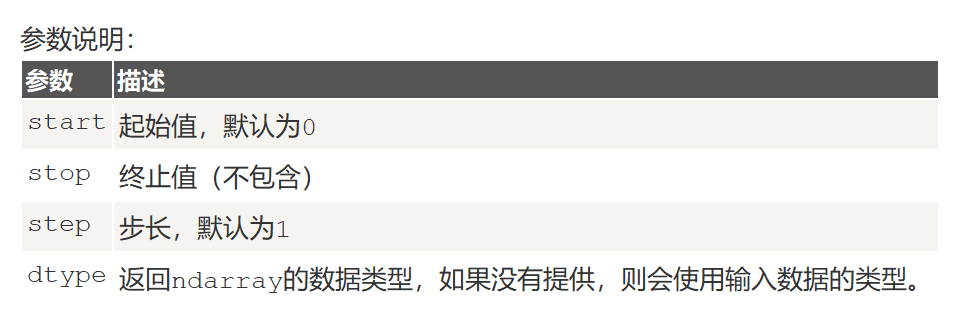

## linspace

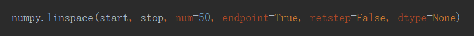

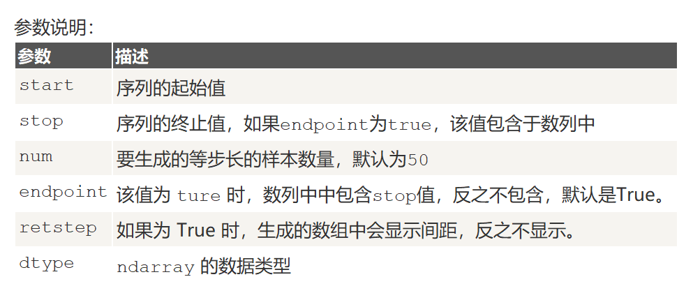

## logspace

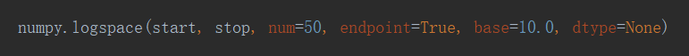

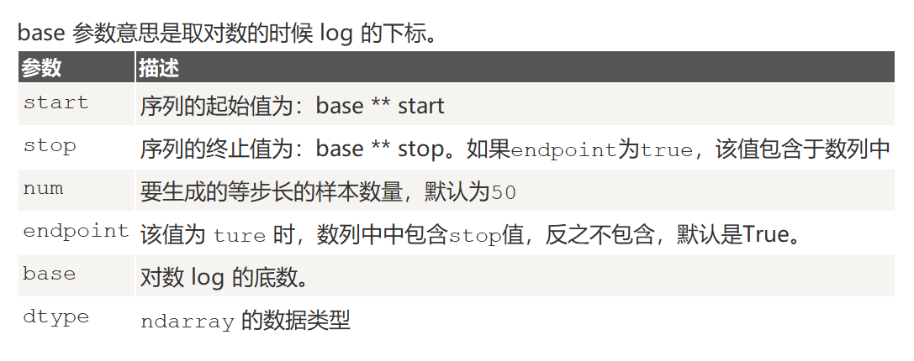

