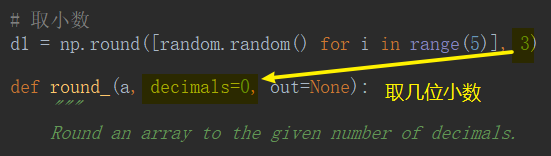

# Numpy

处理数值型数据

## eye

------

## array

### ndmin

### dtype

#### 调整数据类型

### 取小数

## ndarray_obj 属性

### 【返回值】.ndmi

ndmi $\rightleftharpoons$ 秩

### 【返回值】.shape

shape $\rightleftharpoons$ 形状

## arange

## linspace

## logspace

