# ADB

`"C:\Users\Quantum\Documents\Environment\Android\SDK\platform-tools\adb.exe"`

- `adb start-server`——启动 adb 服务器

```bash
adb start-server
# 如果没启动
adb nodaemon server
# 查看进程
netstat -ano | findstr "5037"
# 如果被占用 杀死
taskkill -f -pid "5037"

adb start-server
```

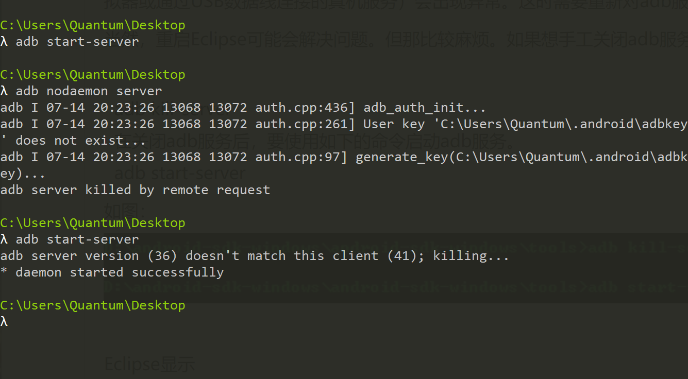

- `adb kill-server`——结束服务

- 启动开发者模式

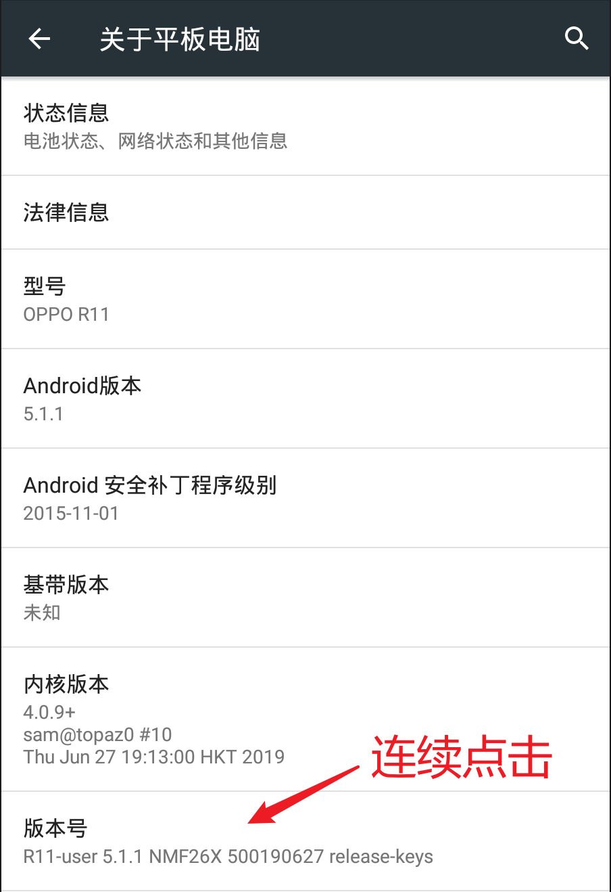


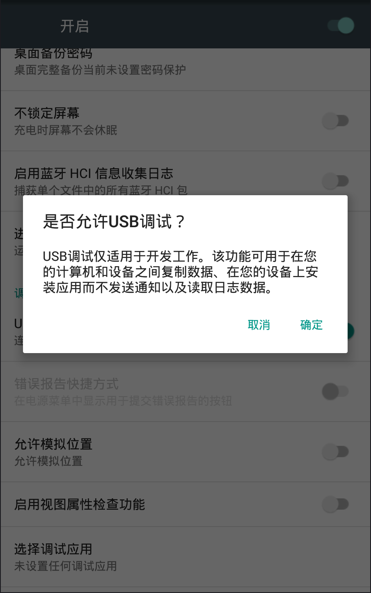

- `adb version`——查看版本

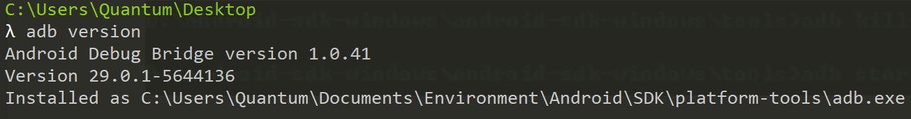

- `adb devices`——查看连接设备

- 同步 adb 

1. `...Android\SDK\platform-tools`

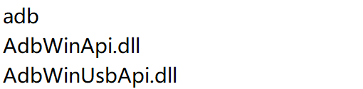

2. `…\Nox\Nox\bin`——夜神 内三个同样文件备份

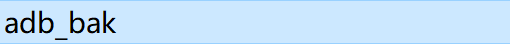

3. 覆盖

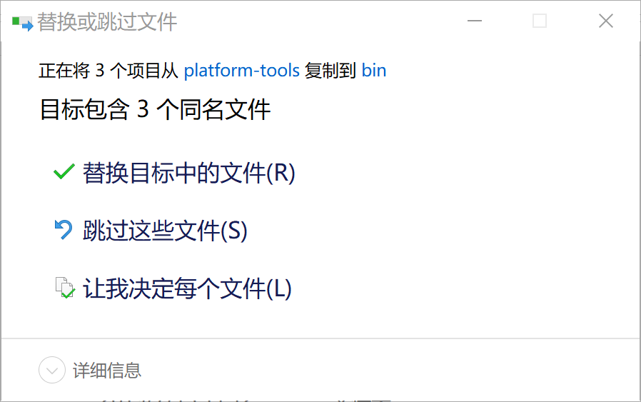

4. `adb version`——查看版本

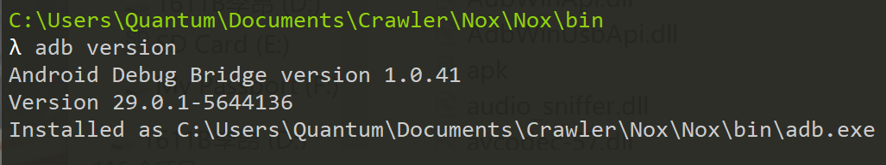

5. `nox_adb`备份，复制 adb.exe 更名为 nox_adb

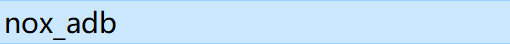

6. `adb devices`——查看连接设备

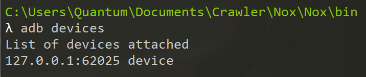

- `adb -s 【设备名】 shell`——进入设备操作系统

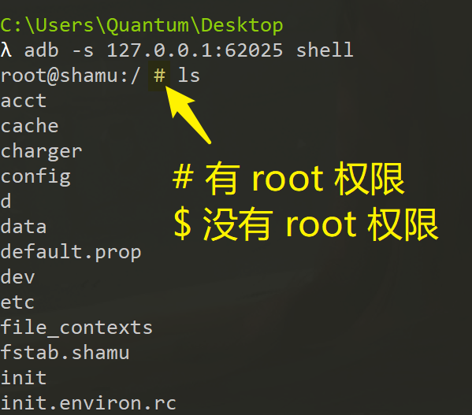

- `adb -s 【设备名】 install 【apk 路径】`——安装 apk 包

- `adb -s 【设备名】 uninstall 【包名】 `——卸载

```bash
# 查看包名
adb -s 【设备名】 shell

cd /data/app

ls

exit
```

- `adb shell pm list package`——查看系统包名

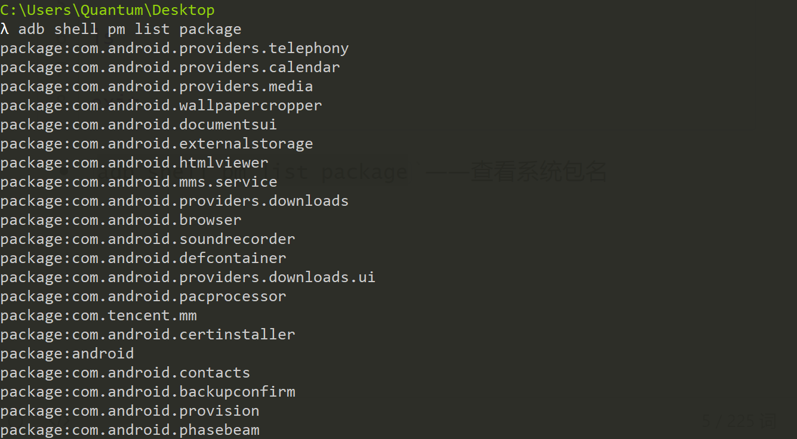

- `adb push 【真机文件路径】 【设备存储位置】`——真机传递文件到设备

- `adb pull 【设备文件路径】 【真机存储位置】`——设备传递文件到真机

- `adb shell screencap 【存储位置】`——设备截图

