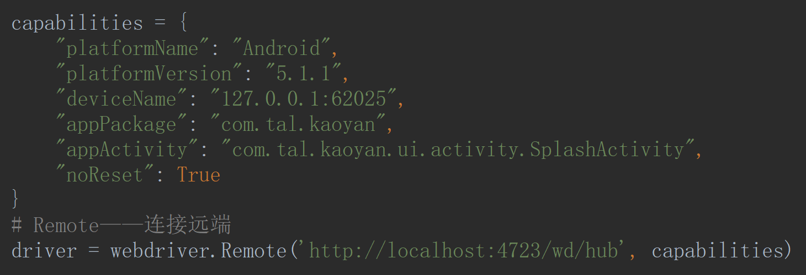

# Appium-Python-Client

```bash
pip3 install Appium-Python-Client
```

## 连接

- `webdriver.Remote(command_executor, desired_capabilities)`——连接远端




- `WebDriverWait(driver, timeout)`——等待判断


## 滑动方法

- `driver.get_window_size()['width']`——取得屏幕的的宽
- `driver.get_window_size()['height']`——取得屏幕的的高


- `driver.swipe(int start x,int start y,int end x,int y,duration) `——滑动


- `driver.swipe(x/2, y*3/4, x/2, y/4, 200)`——上滑

- `driver.swipe(x/2, y/4, x/2, y*3/4, 200)`——下滑

- `driver.swipe(x*3/4, y/2, x/4, y/2, 200)`——右滑

- `driver.swipe(x/4, y/2, x*3/4, y/2, 200)`——左滑

