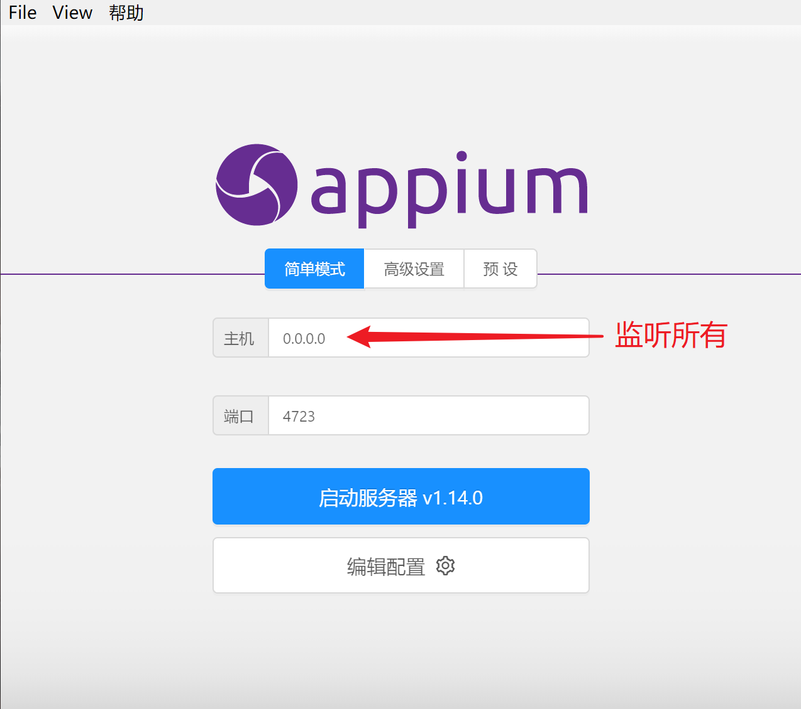

# Appium

<ol>
    <li><a href='JDK'>JDK</a></li>
    <li><a href='SDK'>SDK</a></li>
    <li><a href='ADB'>ADB</a></li>
    <li><a href='Inspector'>Inspector</a></li>
    <li><a href='Appium-Python-Client'>Appium-Python-Client</a></li>
</ol>

