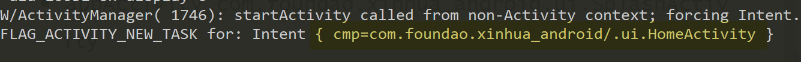

# Inspector

## 所需功能

- `platformName`:`Andriod`

- `platformVersion`:`5.1.1`


- `deviceName`:`127.0.0.1:62025`


- `appPackage`:`com.foundao.xinhua_android`

`"C:\Users\Quantum\Documents\Environment\Android\SDK\build-tools\29.0.1\aapt.exe"`

```bash
cd "C:\Users\Quantum\Documents\Environment\Android\SDK\build-tools\29.0.1\aapt.exe"

aapt.exe dump badging 【apk 储存路径】 | find "package"
```


- `appActivity`:`com.foundao.xinhua_android.ui.SplashActivity`

```bash
aapt.exe dump badging 【apk 储存路径】 | find "launchable-activity"

```


- 另一种获取

```bash
adb shell

logcat | grep cmp=

# 打开夜神模拟器，点开 app
```



- `noReset`:`true`——第二次启动再添加 **布尔值**


## 开启会话


com.tal.kaoyan/com.kaoyan.kylogin.ui.info.PerfectInformationActivity

