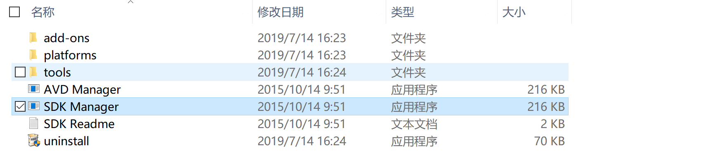
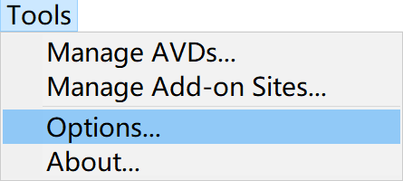
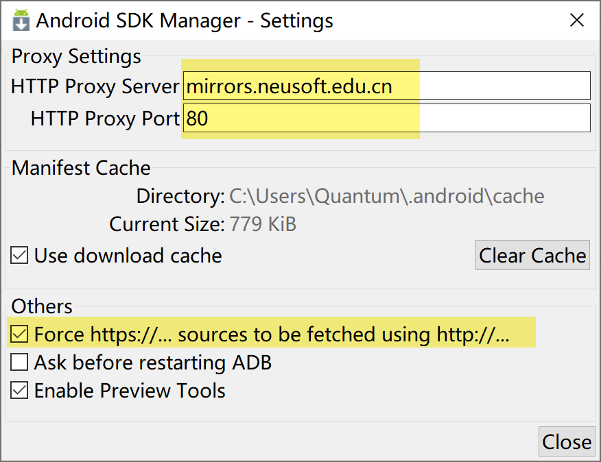
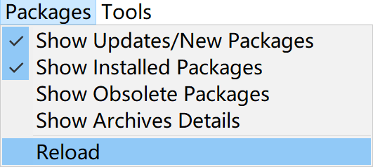
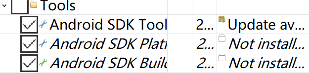
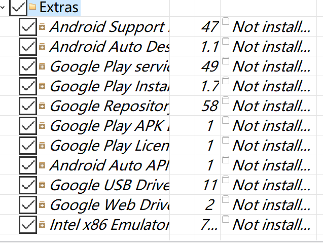
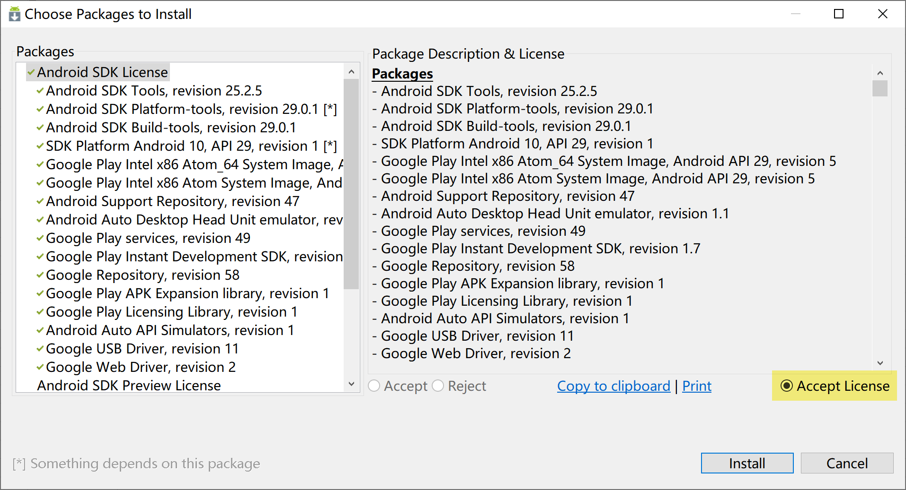

# SDK

<ul>
    <li><a href='http://www.android-studio.org/index.php/download'>sdk</a></li>
</ul>

## 环境变量

- ANDROID_HOME

`C:\Users\Quantum\Documents\Environment\Android\SDK`

- Path

`%ANDROID_HOME%\platform-tools`

`%ANDROID_HOME%\tools`

## 

- SDK Manager

- 代理

`mirrors.neusoft.edu.cn`

`80`

- 加载

- 安装勾选

右下角安装按钮

- 同意

