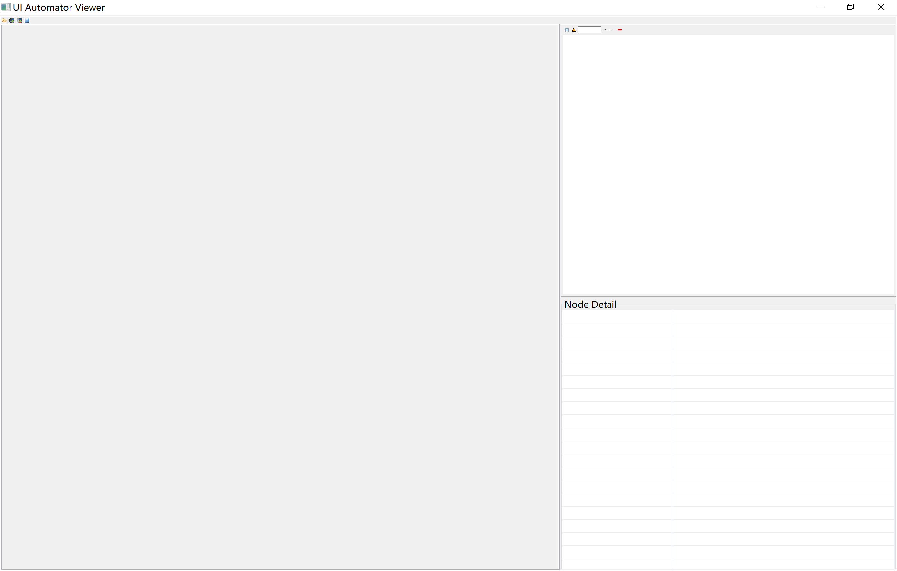

# Uiautomatorviewer

`"C:\Users\Quantum\Documents\Environment\Android\SDK\tools\uiautomatorviewer.bat"`

- 第二个图标连接

- 升级

1. 下载

https://github.com/lazytestteam/lazyuiautomatorviewer

2. 找到 jar 包，替换

`"...Android\SDK\tools\lib\uiautomatorviewer.jar"`

