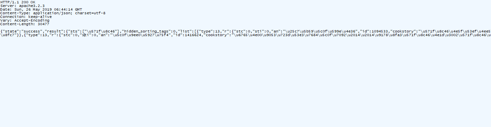
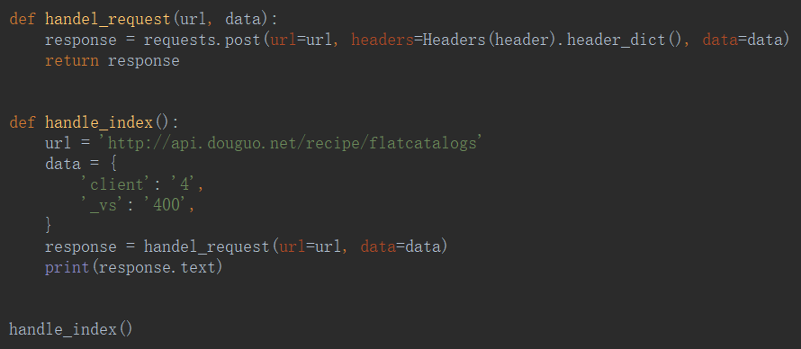
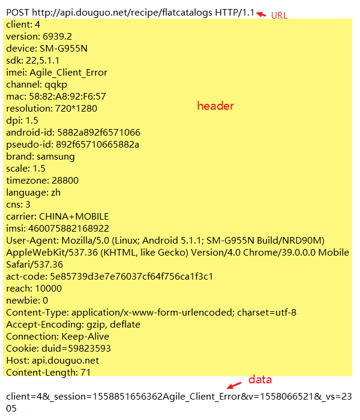
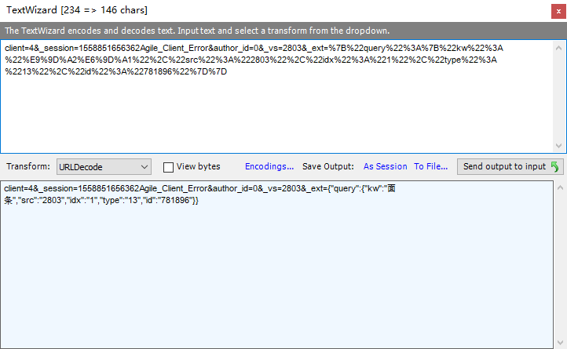
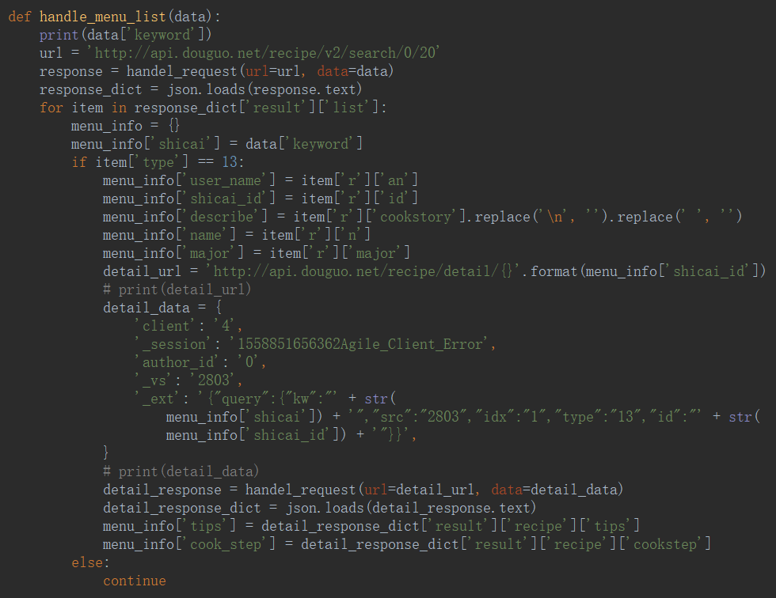

# 分析数据包——豆果美食




```unicode
{"state":"success","result":{"sts":["\u571f\u8c46"],"hidden_sorting_tags":0,"list":[{"type":13,"r":{"stc":0,"sti":0,"an":"\u25c7\u5b59\u5c0f\u599e\u4e36","id":1094533,"cookstory":"\u571f\u8c46\u4e5f\u53ef\u4ee5\u7cd6\u918b\u54df\u3002\u3002\u7ed9\u4f60\u4e0d\u4e00\u6837\u7684\u611f\u89c9\u3002","n":"\u7cd6\u918b\u571f\u8c46","img":"https:\/\/cp1.douguo.com\/upload\/caiku\/5\/b\/f\/300_5b55bff915853e384f06ab9b373cfc5f.jpg","dc":31,"fc":75031,"ecs":0,"hq":0,"a":{"id":7390897,"n":"\u25c7\u5b59\u5c0f\u599e\u4e36","v":0,"p":"http:\/\/tx1.douguo.net\/static\/img\/70.jpg","lvl":4,"is_prime":false,"lv":0},"p":"https:\/\/cp1.douguo.com\/upload\/caiku\/5\/b\/f\/600_5b55bff915853e384f06ab9b373cfc5f.jpg","cook_difficulty":"\u5207\u58a9(\u521d\u7ea7)","cook_time":"10-30\u5206\u949f","tags":[{"t":"\u5feb\u624b\u83dc"},{"t":"\u4e0b\u996d\u83dc"},{"t":"\u7cd6\u918b"},{"t":"\u7092"},{"t":"\u6d59\u83dc"},{"t":"\u70ed\u83dc"},{"t":"\u7092\u9505"},{"t":"\u5348\u9910"},{"t":"\u665a\u9910"},{"t":"\u9999"},{"t":"\u751c"},{"t":"\u9178"},{"t":"\u9178\u751c"},{"t":"\u4e2d\u56fd\u83dc"},{"t":"\u9505\u5177"},{"t":"\u9664\u5915"},{"t":"\u5a74\u5e7c\u513f"},{"t":"3\u5c81\u4ee5\u4e0a"},{"t":"2-3\u5c81"},{"t":"\u5bb6\u5e38\u83dc"}],"vc":1176966,"recommend_label":"31\u4eba\u6700\u8fd1\u505a\u8fc7","display_ingredient":1,"major":[{"note":"\u4e00\u4e2a","title":"\u571f\u8c46"},{"note":"\u4e00\u6c64\u5319","title":"\u6599\u9152"},{"note":"\u4e24\u6c64\u5319","title":"\u751f\u62bd"},{"note":"\u4e09\u6c64\u5319","title":"\u767d\u7cd6"},{"note":"\u56db\u6c64\u5319","title":"\u918b"},{"note":"\u4e94\u6c64\u5319","title":"\u6e05\u6c34"},{"note":"\u9002\u91cf","title":"\u767d\u829d\u9ebb"}],"pw":800,"ph":800,"rate":4.5999999999999996,"recommendation_tag":"1255\u4eba\u505a\u8fc7"}},{"type":13,"r":{"stc":0,"sti":0,"an":"\u5496\u5561\u4e0d\u82e61","id":827432,"cookstory":"","n":"\u9178\u8fa3\u571f\u8c46\u4e1d","img":"https:\/\/cp1.douguo.com\/upload\/caiku\/9\/c\/f\/300_9cca598e2d324a613a68b2be409cf98f.jpg","dc":4,"fc":108306,"ecs":0,"hq":0,"a":{"id":4653569,"n":"\u5496\u5561\u4e0d\u82e61","v":0,"p":"http:\/\/tx1.douguo.net\/upload\/photo\/4\/e\/e\/70_u03414811323402201702.jpg","lvl":1,"is_prime":false,"lv":0},"p":"https:\/\/cp1.douguo.com\/upload\/caiku\/9\/c\/f\/600_9cca598e2d324a613a68b2be409cf98f.jpg","cook_difficulty":"\u5207\u58a9(\u521d\u7ea7)","cook_time":"10-30\u5206\u949f","tags":[{"t":"\u5bb6\u5e38\u83dc"},{"t":"\u5feb\u624b\u83dc"},{"t":"\u7d20\u83dc"},{"t":"\u7d20\u98df\u8005"},{"t":"\u7092"},{"t":"\u9178"},{"t":"\u8fa3"},{"t":"\u5348\u9910"},{"t":"\u4e2d\u56fd\u83dc"}],"vc":1729693,"recommend_label":"108306\u4eba\u521a\u521a\u6536\u85cf\u8fc7","display_ingredient":1,"major":[{"note":"\u4e00\u4e2a","title":"\u571f\u8c46"},{"note":"\u5c11\u8bb8","title":"\u6cb9"}],"pw":800,"ph":530,"rate":4.7000000000000002,"recommendation_tag":"772\u4eba\u505a\u8fc7"}},{"type":13,"r":{"stc":0,"sti":0,"an":"\u4e50\u60a0\u53a8\u623f","id":1177600,"cookstory":"      \u571f\u8c46\u4e1d\uff0c\u518d\u5bb6\u5e38\u4e0d\u8fc7\u7684\u4e00\u9053\u5c0f\u83dc\uff0c\u4f46\u8ba9\u65e0\u6570\u4eba\u6bd5\u751f\u949f\u7231\u3002\u54b8\u7684\u3001\u9178\u7684\u3001\u8fa3\u7684\uff1b\u51c9\u62cc\u7684\u3001\u709d\u7092\u7684\uff0c\u6837\u6837\u53d7\u4eba\u8ffd\u6367\u3002\u8364\u8165\u5403\u591a\u4e86\uff0c\u6e05\u80a0\u6765\u9053\u571f\u8c46\u4e1d\uff1b\u65f6\u95f4\u7d27\u5f20\uff0c\u5feb\u624b\u5c0f\u7092\u6765\u9053\u571f\u8c46\u4e1d\uff1b\u723d\u53e3\u4e0b\u996d\u6765\u9053\u571f\u8c46\u4e1d\u3002\u603b\u4e4b\uff0c\u8fd9\u9053\u83dc\u53e3\u611f\u8106\u723d\u3001\u9999\u8fa3\u4e0b\u996d\u53c8\u5b9e\u60e0\u6613\u505a\uff0c\u867d\u662f\u4e00\u4ecb\u5bb6\u5e38\uff0c\u5374\u80dc\u8fc7\u65e0\u6570\u7f8e\u5473\u3002\n      \u5e38\u98df\u571f\u8c46\u5bf9\u8eab\u4f53\u4e5f\u6781\u6709\u597d\u5904\uff0c\u7956\u56fd\u533b\u5b66\u8ba4\u4e3a\uff0c\u571f\u8c46\u6027\u5e73\uff0c\u6709\u548c\u80c3\u3001\u8c03\u4e2d\u3001\u5065\u813e\u3001\u76ca\u6c14\u4e4b\u529f\u6548\u3002\u571f\u8c46\u4e2d\u542b\u6709\u4e30\u5bcc\u7684\u94be\u5143\u7d20\uff0c\u53ef\u4ee5\u6709\u6548\u5730\u9884\u9632\u9ad8\u8840\u538b\u3002\u5f53\u4eba\u4f53\u8fc7\u591a\u5730\u6444\u5165\u76d0\u5206\u540e\uff0c\u4f53\u5185\u94a0\u5143\u7d20\u5c31\u4f1a\u504f\u9ad8\uff0c\u94be\u5448\u73b0\u51fa\u4e0d\u8db3\u4ece\u800c\u5f15\u8d77\u9ad8\u8840\u538b\uff0c\u6545\u5e38\u5403\u571f\u8c46\u80fd\u53ca\u65f6\u5730\u7ed9\u4f53\u5185\u8865\u5145\u6240\u9700\u6c42\u7684\u94be\u5143\u7d20\uff1b\u53e6\u5916\uff0c\u571f\u8c46\u4e2d\u7684\u7ef4\u751f\u7d20C\u5bf9\u8eab\u4f53\u4e5f\u6709\u5f88\u597d\u7684\u4fdd\u5065\u4f5c\u7528\u3002\n","n":"\u709d\u7092\u571f\u8c46\u4e1d","img":"https:\/\/cp1.douguo.com\/upload\/caiku\/5\/b\/c\/300_5b7879b0c2128c5f64a6343b2929e4fc.jpg","dc":199,"fc":96240,"ecs":0,"hq":0,"a":{"id":4568726,"n":"\u4e50\u60a0\u53a8\u623f","v":1,"p":"http:\/\/tx1.douguo.net\/upload\/photo\/b\/d\/7\/70_u02369349224948172948.jpeg","lvl":6,"is_prime":false,"lv":0},"p":"https:\/\/cp1.douguo.com\/upload\/caiku\/5\/b\/c\/600_5b7879b0c2128c5f64a6343b2929e4fc.jpg","cook_difficulty":"\u5207\u58a9(\u521d\u7ea7)","cook_time":"10-30\u5206\u949f","tags":[{"t":"\u9505\u5177"},{"t":"\u7092\u9505"},{"t":"\u5feb\u624b\u83dc"},{"t":"\u709d"},{"t":"\u54b8"},{"t":"\u4e00\u5bb6\u4e09\u53e3"},{"t":"\u665a\u9910"},{"t":"\u5348\u9910"},{"t":"\u4e0b\u996d\u83dc"},{"t":"\u8fa3"},{"t":"\u9999"},{"t":"\u7092"},{"t":"\u7d20\u83dc"},{"t":"\u70ed\u83dc"},{"t":"\u4e00\u4eba\u98df"},{"t":"\u5bb6\u5e38\u83dc"},{"t":"\u4e2d\u56fd\u83dc"}],"vc":5449682,"recommend_label":"199\u4eba\u6700\u8fd1\u505a\u8fc7","display_ingredient":1,"major":[{"note":"2\u4e2a","title":"\u571f\u8c46"}],"pw":800,"ph":533,"rate":4.5999999999999996,"recommendation_tag":"1101\u4eba\u505a\u8fc7"}},{"type":13,"r":{"stc":0,"sti":0,"an":"\u5bb6\u5e38\u7f8e\u98df","id":198809,"cookstory":"","n":"\u571f\u8c46\u7ea2\u70e7\u8089","img":"https:\/\/cp1.douguo.com\/upload\/caiku\/5\/a\/0\/300_5ad1025d317f9404f23e0f4ef715c540.jpg","dc":8,"fc":27664,"ecs":0,"hq":0,"a":{"id":2161904,"n":"\u5bb6\u5e38\u7f8e\u98df","v":0,"p":"http:\/\/tx1.douguo.net\/static\/img\/70.jpg","lvl":1,"is_prime":false,"lv":0},"p":"https:\/\/cp1.douguo.com\/upload\/caiku\/5\/a\/0\/600_5ad1025d317f9404f23e0f4ef715c540.jpg","cook_difficulty":"","cook_time":"","tags":[{"t":"\u670b\u53cb\u805a\u9910"},{"t":"\u7ea2\u70e7"},{"t":"\u9999"},{"t":"\u5a74\u5e7c\u513f"},{"t":"3\u5c81\u4ee5\u4e0a"},{"t":"\u5bb6\u5e38\u83dc"}],"vc":778607,"recommend_label":"27664\u4eba\u521a\u521a\u6536\u85cf\u8fc7","display_ingredient":1,"major":[{"note":"\u4e8c\u65a4","title":"\u4e94\u82b1\u8089"},{"note":"\u9002\u91cf","title":"\u8471\u6bb5"},{"note":"2\u5927\u52fa","title":"\u751f\u62bd"},{"note":"\u4e09\u4e2a","title":"\u571f\u8c46"},{"note":"\u9002\u91cf","title":"\u59dc\u7247"}],"pw":500,"ph":414,"rate":4.5,"recommendation_tag":"531\u4eba\u505a\u8fc7"}},{"type":13,"r":{"stc":0,"sti":0,"an":"\u5e73\u5e73\u5154","id":230048,"cookstory":"\u559c\u6b22\u5403\u571f\u8c46\u7684\u4eb2\u4eec\u4e0d\u8981\u9519\u8fc7\u4e86\u54e6\uff5e","n":"\u829d\u58eb\u571f\u8c46\u7403","img":"https:\/\/cp1.douguo.com\/upload\/caiku\/f\/3\/0\/300_f36a6bd9f842967ce89f16634acdcfd0.jpg","dc":21,"fc":56722,"ecs":0,"hq":0,"a":{"id":2471572,"n":"\u5e73\u5e73\u5154","v":0,"p":"http:\/\/tx1.douguo.net\/upload\/photo\/9\/d\/b\/70_u60500717117366193521.jpg","lvl":4,"is_prime":false,"lv":0},"p":"https:\/\/cp1.douguo.com\/upload\/caiku\/f\/3\/0\/600_f36a6bd9f842967ce89f16634acdcfd0.jpg","cook_difficulty":"","cook_time":"","tags":[{"t":"\u70d8\u7119"},{"t":"\u70d8\u70e4"},{"t":"\u751c"},{"t":"\u54b8"},{"t":"\u5c0f\u5403"},{"t":"\u7535\u5668"},{"t":"\u70e4\u7bb1"},{"t":"\u4e00\u4eba\u98df"},{"t":"\u5a74\u5e7c\u513f"},{"t":"10-12\u4e2a\u6708"},{"t":"\u65e9\u9910"},{"t":"\u8865\u9499"},{"t":"\u714e\u997c"}],"vc":1164631,"recommend_label":"21\u4eba\u6700\u8fd1\u505a\u8fc7","display_ingredient":1,"major":[{"note":"150\u514b","title":"\u571f\u8c46"},{"note":"150\u514b","title":"\u7cef\u7c73\u7c89"}],"pw":600,"ph":399,"rate":4.5,"recommendation_tag":"503\u4eba\u505a\u8fc7"}},{"type":13,"r":{"vu":"http:\/\/player.video.qiyi.com\/cfdae6b222bd44bb87c6698114f5975b\/0\/104\/life\/20121028\/ccf2eb4988b58208.swf-pid=50968-ptype=2-albumId=255123-tvId=299519-coop=coop_douguo20130822-cid=qc_100001_300138-bd=1","vfurl":"","stc":0,"sti":0,"an":"\u7ea2\u59e8\u98df\u574a","id":196534,"cookstory":"\u571f\u8c46\u5473\u7518\uff0c\u6027\u5e73\uff1b\u80fd\u8865\u813e\u76ca\u6c14\uff0c\u7f13\u6025\u6b62\u75db\uff0c\u901a\u5229\u5927\u4fbf\u3002\u73b0\u4ee3\u533b\u5b66\u7814\u7a76\u8ba4\u4e3a\uff0c\u571f\u8c46\u662f\u9ad8\u86cb\u767d\u3001\u4f4e\u8102\u80aa\u3001\u4f4e\u70ed\u91cf\u7684\u5065\u5eb7\u98df\u54c1\uff0c\u662f\u80a5\u80d6\u75c7\u60a3\u8005\u3001\u5fc3\u8111\u8840\u7ba1\u75c5\u60a3\u8005\u3001\u7cd6\u5c3f\u75c5\u60a3\u8005\u7684\u7406\u60f3\u98df\u54c1\u3002\u7ecf\u5e38\u5403\u571f\u8c46\uff0c\u53ef\u4ee5\u4f7f\u8eab\u4f53\u5065\u5eb7\uff0c\u5ef6\u7f13\u8870\u8001\uff0c\u8001\u4eba\u5e38\u5403\u571f\u8c46\u53ef\u6cbb\u5931\u7720\u3002\n\n","n":"\u5fae\u6ce2\u7089\u81ea\u5236\u85af\u7247","img":"https:\/\/cp1.douguo.com\/upload\/caiku\/2\/e\/9\/300_2e7518e9da42ca8b7cf5562c171e8379.jpg","dc":652,"fc":64527,"ecs":0,"hq":0,"a":{"id":42891,"n":"\u7ea2\u59e8\u98df\u574a","v":1,"p":"http:\/\/tx1.douguo.net\/upload\/photo\/0\/6\/1\/70_u09314501.jpg","lvl":5,"is_prime":false,"lv":0},"p":"https:\/\/cp1.douguo.com\/upload\/caiku\/2\/e\/9\/600_2e7518e9da42ca8b7cf5562c171e8379.jpg","cook_difficulty":"\u5207\u58a9(\u521d\u7ea7)","cook_time":"10\u5206\u5de6\u53f3","tags":[{"t":"\u5c0f\u5403"},{"t":"\u96f6\u98df"},{"t":"\u4e0b\u5348\u8336"},{"t":"\u5fae\u6ce2\u7089"},{"t":"\u70d8\u70e4"},{"t":"\u9999"},{"t":"\u6c14\u865a\u8d28"},{"t":"\u5e73\u548c\u8d28"},{"t":"\u670b\u53cb\u805a\u9910"},{"t":"\u751f\u65e5\u805a\u4f1a"},{"t":"\u4e00\u5bb6\u4e09\u53e3"},{"t":"\u7535\u5668"}],"vc":1073696,"recommend_label":"652\u4eba\u6700\u8fd1\u505a\u8fc7","display_ingredient":1,"major":[{"note":"2\u4e2a","title":"\u571f\u8c46"}],"pw":500,"ph":637,"rate":4.5,"recommendation_tag":"1025\u4eba\u505a\u8fc7"}},{"type":13,"r":{"stc":0,"sti":0,"an":"\u4f51\u89c1\u708a\u70df","id":1101781,"cookstory":"    \u571f\u8c46\u662f\u6211\u7684\u6700\u7231\u4e4b\u4e00\uff0c\u5b69\u5b50\u4e5f\u9057\u4f20\u4e86\u6211\u7684\u8fd9\u4e2a\u559c\u597d\uff0c\u4e0d\u7ba1\u600e\u4e48\u505a\u90fd\u559c\u6b22\u5403\u3002\u4eca\u5929\u505a\u7684\u8fd9\u4e2a\u7ea2\u70e7\u571f\u8c46\u54b8\u751c\u9002\u5b9c\uff0c\u5b69\u5b50\u7279\u522b\u559c\u6b22\uff0c\u6211\u5403\u5f97\u8f83\u5c11\uff0c\u4e3b\u8981\u662f\u6015\u957f\u80d6\uff0c\u518d\u559c\u6b22\u4e5f\u8981\u60a0\u7740\u70b9\u3002","n":"\u7ea2\u70e7\u571f\u8c46","img":"https:\/\/cp1.douguo.com\/upload\/caiku\/c\/6\/5\/300_c64b6fdb7ce97349db1f44ab68b1b9d5.jpg","dc":27,"fc":70536,"ecs":0,"hq":0,"a":{"id":4367538,"n":"\u4f51\u89c1\u708a\u70df","v":0,"p":"http:\/\/tx1.douguo.net\/upload\/photo\/a\/1\/f\/70_u9929645438598106202205.png","lvl":3,"is_prime":false,"lv":0},"p":"https:\/\/cp1.douguo.com\/upload\/caiku\/c\/6\/5\/600_c64b6fdb7ce97349db1f44ab68b1b9d5.jpg","cook_difficulty":"\u5207\u58a9(\u521d\u7ea7)","cook_time":"10\u5206\u5de6\u53f3","tags":[{"t":"\u4e2d\u56fd\u83dc"},{"t":"\u5bb6\u5e38\u83dc"},{"t":"\u5348\u9910"},{"t":"\u9505\u5177"},{"t":"\u7092\u9505"},{"t":"\u7ea2\u70e7"},{"t":"\u54b8"},{"t":"\u4e0b\u996d\u83dc"},{"t":"\u5feb\u624b\u83dc"}],"vc":1216182,"recommend_label":"27\u4eba\u6700\u8fd1\u505a\u8fc7","display_ingredient":1,"major":[{"note":"350\u514b","title":"\u571f\u8c46"},{"note":"2\u6839","title":"\u5927\u849c\u53f6"}],"pw":800,"ph":600,"rate":4.7000000000000002,"recommendation_tag":"822\u4eba\u505a\u8fc7"}},{"type":13,"r":{"stc":0,"sti":0,"an":"\u5927\u83dc\u7684\u7f8e\u98df\u7269\u8bed","id":1069475,"cookstory":"","n":"\u6700\u4e0a\u763e\u7684\u7edd\u5473\u5ddd\u83dc\u2014\u2014\u51c9\u62cc\u571f\u8c46\u7247","img":"https:\/\/cp1.douguo.com\/upload\/caiku\/8\/e\/4\/300_8e9626db75fcd83eb69fd14d71ea2284.jpg","dc":24,"fc":130614,"ecs":0,"hq":0,"a":{"id":628485,"n":"\u5927\u83dc\u7684\u7f8e\u98df\u7269\u8bed","v":1,"p":"http:\/\/tx1.douguo.net\/upload\/photo\/8\/4\/a\/70_u29494703939041.jpg","lvl":3,"is_prime":false,"lv":0},"p":"https:\/\/cp1.douguo.com\/upload\/caiku\/8\/e\/4\/600_8e9626db75fcd83eb69fd14d71ea2284.jpg","cook_difficulty":"\u5207\u58a9(\u521d\u7ea7)","cook_time":"10-30\u5206\u949f","tags":[{"t":"\u5348\u9910"},{"t":"\u7092\u9505"},{"t":"\u9505\u5177"},{"t":"\u51c9\u83dc"},{"t":"\u9178\u8fa3"},{"t":"\u8fa3"},{"t":"\u62cc"},{"t":"\u665a\u9910"},{"t":"\u5ddd\u83dc"},{"t":"\u4e2d\u56fd\u83dc"},{"t":"\u9664\u5915"}],"vc":2139384,"recommend_label":"24\u4eba\u6700\u8fd1\u505a\u8fc7","display_ingredient":1,"major":[{"note":"250\u514b","title":"\u571f\u8c46"}],"pw":800,"ph":1146,"rate":4.7000000000000002,"recommendation_tag":"801\u4eba\u505a\u8fc7"}},{"type":13,"r":{"stc":0,"sti":0,"an":"\u8c46\u7c89853054","id":193096,"cookstory":"","n":"\u5c16\u6912\u7092\u571f\u8c46\u7247","img":"https:\/\/cp1.douguo.com\/upload\/caiku\/1\/e\/3\/300_1e5d88606c07132b517bef50fcd6a1b3.png","dc":26,"fc":18608,"ecs":0,"hq":0,"a":{"id":56022,"n":"\u8c46\u7c89853054","v":1,"p":"http:\/\/tx1.douguo.net\/upload\/photo\/d\/f\/0\/70_u15288235.jpg","lvl":5,"is_prime":false,"lv":0},"p":"https:\/\/cp1.douguo.com\/upload\/caiku\/1\/e\/3\/600_1e5d88606c07132b517bef50fcd6a1b3.png","cook_difficulty":"\u5207\u58a9(\u521d\u7ea7)","cook_time":"10\u5206\u5de6\u53f3","tags":[{"t":"\u5bb6\u5e38\u83dc"},{"t":"\u7092"},{"t":"\u54b8"},{"t":"\u5fae\u8fa3"},{"t":"\u4e0b\u996d\u83dc"},{"t":"\u7d20\u83dc"},{"t":"\u70ed\u83dc"},{"t":"\u7092\u9505"},{"t":"\u5348\u9910"},{"t":"\u665a\u9910"},{"t":"\u4e00\u5bb6\u4e09\u53e3"},{"t":"\u4e2d\u56fd\u83dc"},{"t":"\u8fa3"},{"t":"\u9505\u5177"}],"vc":609234,"recommend_label":"26\u4eba\u6700\u8fd1\u505a\u8fc7","display_ingredient":1,"major":[{"note":"","title":"\u571f\u8c46"},{"note":"","title":"\u5c16\u6912"}],"pw":522,"ph":509,"rate":4.5999999999999996,"recommendation_tag":"897\u4eba\u505a\u8fc7"}},{"dsp":{"id":"ad5075","pid":"1003543","ch":24,"url":"","i":"","cap":"\u5e7f\u544a","position":"30searchadvertisement","query":"","client_ip":"218.61.244.196","req_min_i":86400,"channel":"","media_type":0,"request_count":4,"max_impression_count":0,"name":"\u667a\u6167\u6811 \u63a8\u8350\u8fbe\u4eba","logo":"http:\/\/i1.douguo.net\/upload\/\/recipe\/a\/8\/a\/a8d42145e55f711d289ac105480222fa.png","user":{"nick":"\u667a\u6167\u6811 \u63a8\u8350\u8fbe\u4eba","user_photo":"http:\/\/i1.douguo.net\/upload\/\/recipe\/a\/8\/a\/a8d42145e55f711d289ac105480222fa.png","lvl":7,"user_id":0},"d":"28922\u4eba\u521a\u521a\u770b\u8fc7","like_count":144,"canclose":1,"imp_trackers":[],"click_trackers":[]},"type":129},{"type":13,"r":{"stc":0,"sti":0,"an":"Dina\u5eb7","id":839192,"cookstory":"","n":"\u571f\u8c46\u997c","img":"https:\/\/cp1.douguo.com\/upload\/caiku\/8\/6\/2\/300_86c8ec3e7fed363e644638e0a259b722.jpg","dc":8,"fc":41682,"ecs":0,"hq":0,"a":{"id":4762472,"n":"Dina\u5eb7","v":0,"p":"http:\/\/tx1.douguo.net\/upload\/photo\/5\/5\/e\/70_u0463175172956081730.jpeg","lvl":3,"is_prime":false,"lv":0},"p":"https:\/\/cp1.douguo.com\/upload\/caiku\/8\/6\/2\/600_86c8ec3e7fed363e644638e0a259b722.jpg","cook_difficulty":"\u5207\u58a9(\u521d\u7ea7)","cook_time":"10~30\u5206\u949f","tags":[{"t":"\u4e3b\u98df"},{"t":"\u997c"},{"t":"\u7535\u997c\u94db"},{"t":"\u70d9"},{"t":"\u665a\u9910"},{"t":"\u5348\u9910"},{"t":"\u4e00\u5bb6\u4e09\u53e3"},{"t":"\u7535\u5668"},{"t":"\u5a74\u5e7c\u513f"},{"t":"\u4e0d\u7231\u5403\u852c\u83dc"},{"t":"8-9\u4e2a\u6708"},{"t":"3\u5c81\u4ee5\u4e0a"},{"t":"2-3\u5c81"},{"t":"1-2\u5c81"},{"t":"10-12\u4e2a\u6708"},{"t":"\u65e9\u9910"},{"t":"\u8865\u9499"},{"t":"\u714e\u997c"}],"vc":1101940,"recommend_label":"41682\u4eba\u521a\u521a\u6536\u85cf\u8fc7","display_ingredient":1,"major":[{"note":"4\u4e2a","title":"\u571f\u8c46"},{"note":"\u9002\u91cf","title":"\u5c0f\u9ea6\u9762\u7c89"},{"note":"1\u52fa","title":"\u76d0"},{"note":"1\u6839","title":"\u706b\u817f\u80a0"},{"note":"\u9002\u91cf","title":"\u98df\u7528\u6cb9"}],"pw":640,"ph":858,"rate":4.5,"recommendation_tag":"422\u4eba\u505a\u8fc7"}},{"type":13,"r":{"stc":0,"sti":0,"an":"\u5c0f\u9ee0\u5927\u75f4","id":1416624,"cookstory":"\u6765\u4e00\u9053\u723d\u53e3\u7684\u5c0f\u7092\u2014\u2014\u9178\u8fa3\u571f\u8c46\u4e1d\u3002\u571f\u8c46\u88ab\u79f0\u4e3a\u8425\u517b\u6700\u9ad8\uff0c\u70ed\u91cf\u6700\u4f4e\u7684\u852c\u83dc\uff0c\u571f\u8c46\u7684\u8425\u517b\u4ef7\u503c\u5f97\u5230\u4e86\u4eba\u4eec\u7684\u4e00\u81f4\u8ba4\u540c\u3002\u571f\u8c46\u80fd\u5e2e\u52a9\u9884\u9632\u80a5\u80d6\uff0c\u66f4\u6709\u5229\u4e8e\u63a7\u5236\u8840\u538b\u3002\u54b1\u4eec\u4e00\u8d77\u628a\u7f8e\u5473\u7684\u571f\u8c46\u4e1d\u7092\u8d77\u6765\u3002","n":"\u9178\u8fa3\u571f\u8c46\u4e1d","img":"https:\/\/cp1.douguo.com\/upload\/caiku\/8\/0\/7\/300_80ce405c31ef3f2ae16a26e4f18a7fd7.jpeg","dc":573,"fc":84296,"ecs":0,"hq":0,"a":{"id":7047725,"n":"\u5c0f\u9ee0\u5927\u75f4","v":1,"p":"http:\/\/tx1.douguo.net\/upload\/photo\/d\/4\/6\/70_u16481807866235211251.jpeg","lvl":6,"is_prime":true,"lv":0},"p":"https:\/\/cp1.douguo.com\/upload\/caiku\/8\/0\/7\/600_80ce405c31ef3f2ae16a26e4f18a7fd7.jpeg","cook_difficulty":"\u5207\u58a9(\u521d\u7ea7)","cook_time":"10\u5206\u5de6\u53f3","tags":[{"t":"\u7092"},{"t":"\u5bb6\u5e38\u83dc"},{"t":"\u9178"},{"t":"\u8fa3"},{"t":"\u5bb6\u5e38\u5473"},{"t":"\u5348\u9910"},{"t":"\u665a\u9910"},{"t":"\u4e2d\u56fd\u83dc"},{"t":"\u5ddd\u83dc"},{"t":"\u4e0b\u996d\u83dc"},{"t":"\u7092\u9505"},{"t":"\u9505\u5177"},{"t":"\u4e00\u5bb6\u4e09\u53e3"}],"vc":4097712,"recommend_label":"573\u4eba\u6700\u8fd1\u505a\u8fc7","display_ingredient":1,"major":[{"note":"3\u5757","title":"\u571f\u8c46"},{"note":"3\u6839","title":"\u5c0f\u8471"},{"note":"3\u4e2a","title":"\u8fa3\u6912"},{"note":"3\u74e3","title":"\u849c"},{"note":"2\u52fa","title":"\u751f\u62bd"},{"note":"1\u8336\u5319","title":"\u767d\u7cd6"},{"note":"1\u8336\u5319","title":"\u82b1\u6912\u7c89"},{"note":"1\u52fa","title":"\u9999\u918b"},{"note":"\u9002\u91cf","title":"\u76d0"}],"pw":1080,"ph":1622,"rate":4.7000000000000002,"recommendation_tag":"887\u4eba\u505a\u8fc7"}},{"type":13,"r":{"stc":0,"sti":0,"an":"\u5a07\u5150kitchen","id":789102,"cookstory":"","n":"\u571f\u8c46\u997c","img":"https:\/\/cp1.douguo.com\/upload\/caiku\/9\/f\/4\/300_9f394ff26d5b27c7fefbd0f8e2f712e4.jpg","dc":108,"fc":50088,"ecs":0,"hq":0,"a":{"id":4191108,"n":"\u5a07\u5150kitchen","v":1,"p":"http:\/\/tx1.douguo.net\/upload\/photo\/9\/3\/f\/70_u96324309451969133830.jpeg","lvl":6,"is_prime":false,"lv":0},"p":"https:\/\/cp1.douguo.com\/upload\/caiku\/9\/f\/4\/600_9f394ff26d5b27c7fefbd0f8e2f712e4.jpg","cook_difficulty":"","cook_time":"","tags":[{"t":"\u9999"},{"t":"\u665a\u9910"},{"t":"\u54b8"},{"t":"\u521b\u610f\u83dc"},{"t":"\u65e0\u6c34\u5370"},{"t":"\u5348\u9910"},{"t":"\u539f\u5473"},{"t":"\u714e"},{"t":"\u5bb6\u5e38\u83dc"},{"t":"\u4e2d\u56fd\u83dc"},{"t":"\u4e3b\u98df"},{"t":"\u9505\u5177"},{"t":"\u714e\u9505"},{"t":"\u65e9\u9910"},{"t":"\u4e00\u4eba\u98df"},{"t":"\u70b8"},{"t":"\u84b8"},{"t":"\u84b8\u9505"},{"t":"\u997c"},{"t":"\u4e00\u5bb6\u4e09\u53e3"},{"t":"\u5bb6\u5e38\u5473"},{"t":"\u5a74\u5e7c\u513f"},{"t":"\u4e0d\u7231\u5403\u852c\u83dc"},{"t":"8-9\u4e2a\u6708"},{"t":"3\u5c81\u4ee5\u4e0a"},{"t":"2-3\u5c81"},{"t":"1-2\u5c81"},{"t":"10-12\u4e2a\u6708"},{"t":"\u8865\u9499"},{"t":"\u714e\u997c"}],"vc":1594804,"recommend_label":"108\u4eba\u6700\u8fd1\u505a\u8fc7","display_ingredient":1,"major":[{"note":"1\u4e2a","title":"\u571f\u8c46"},{"note":"\u9002\u91cf","title":"\u80e1\u841d\u535c"},{"note":"\u9002\u91cf","title":"\u6d0b\u8471"},{"note":"1\u4e2a","title":"\u9e21\u86cb"},{"note":"\u9002\u91cf","title":"\u8471\u82b1"},{"note":"","title":"\u76d0"},{"note":"","title":"\u80e1\u6912\u7c89"}],"pw":800,"ph":600,"rate":4.5999999999999996,"recommendation_tag":"887\u4eba\u505a\u8fc7"}},{"type":13,"r":{"stc":0,"sti":0,"an":"Tony\u5c0f\u5c4b","id":973935,"cookstory":"","n":"\u9178\u8fa3\u571f\u8c46\u4e1d","img":"https:\/\/cp1.douguo.com\/upload\/caiku\/a\/5\/e\/300_a53afdfb49d05d106aa094496efde85e.jpg","dc":3,"fc":83855,"ecs":0,"hq":0,"a":{"id":436351,"n":"Tony\u5c0f\u5c4b","v":1,"p":"http:\/\/tx1.douguo.net\/upload\/photo\/9\/8\/4\/70_u21945251.jpg","lvl":5,"is_prime":false,"lv":0},"p":"https:\/\/cp1.douguo.com\/upload\/caiku\/a\/5\/e\/600_a53afdfb49d05d106aa094496efde85e.jpg","cook_difficulty":"\u5207\u58a9(\u521d\u7ea7)","cook_time":"10-30\u5206\u949f","tags":[{"t":"\u7092"},{"t":"\u9178"},{"t":"\u8fa3"},{"t":"\u4e0b\u996d\u83dc"},{"t":"\u5feb\u624b\u83dc"},{"t":"\u9505\u5177"},{"t":"\u7092\u9505"},{"t":"\u4e00\u5bb6\u4e09\u53e3"},{"t":"\u665a\u9910"},{"t":"\u5348\u9910"},{"t":"\u5ddd\u83dc"},{"t":"\u4e2d\u56fd\u83dc"}],"vc":3865504,"recommend_label":"83855\u4eba\u521a\u521a\u6536\u85cf\u8fc7","display_ingredient":1,"major":[{"note":"","title":"\u571f\u8c46"}],"pw":600,"ph":900,"rate":4.5,"recommendation_tag":"654\u4eba\u505a\u8fc7"}},{"type":13,"r":{"stc":0,"sti":0,"an":"\u7389\u6c60\u6843\u7ea2","id":203408,"cookstory":"","n":"\u597d\u5403\u597d\u73a9\u7684\u7ebd\u6263\u571f\u8c46\u997c  ","img":"https:\/\/cp1.douguo.com\/upload\/caiku\/9\/7\/e\/300_974df63fda1fef77b69d28b2cbf269ae.jpg","dc":6,"fc":44423,"ecs":0,"hq":0,"a":{"id":437457,"n":"\u7389\u6c60\u6843\u7ea2","v":1,"p":"http:\/\/tx1.douguo.net\/upload\/photo\/f\/2\/0\/70_u2203295410091407.jpg","lvl":6,"is_prime":false,"lv":0},"p":"https:\/\/cp1.douguo.com\/upload\/caiku\/9\/7\/e\/600_974df63fda1fef77b69d28b2cbf269ae.jpg","cook_difficulty":"\u5207\u58a9(\u521d\u7ea7)","cook_time":"10-30\u5206\u949f","tags":[{"t":"\u4e2d\u56fd\u83dc"},{"t":"\u5bb6\u5e38\u83dc"},{"t":"\u70b8"},{"t":"\u9999"},{"t":"\u4e0b\u9152\u83dc"},{"t":"\u9505\u5177"},{"t":"\u714e\u9505"},{"t":"\u4e0b\u5348\u8336"},{"t":"\u665a\u9910"}],"vc":805712,"recommend_label":"44423\u4eba\u521a\u521a\u6536\u85cf\u8fc7","display_ingredient":1,"major":[{"note":"\u4e24\u4e2a","title":"\u571f\u8c46"}],"pw":600,"ph":800,"rate":4.5999999999999996,"recommendation_tag":"463\u4eba\u505a\u8fc7"}},{"type":13,"r":{"stc":0,"sti":0,"an":"\u4e07\u4e07","id":182667,"cookstory":"","n":"\u571f\u8c46\u70e7\u725b\u8089","img":"https:\/\/cp1.douguo.com\/upload\/caiku\/1\/1\/0\/300_11c07f36579bf85d694f88ce494c0f10.jpg","dc":53,"fc":22917,"ecs":0,"hq":0,"a":{"id":41346,"n":"\u4e07\u4e07","v":1,"p":"http:\/\/tx1.douguo.net\/upload\/photo\/d\/2\/c\/70_u08188965.jpg","lvl":5,"is_prime":false,"lv":0},"p":"https:\/\/cp1.douguo.com\/upload\/caiku\/1\/1\/0\/600_11c07f36579bf85d694f88ce494c0f10.jpg","cook_difficulty":"\u638c\u52fa(\u9ad8\u7ea7)","cook_time":"10-30\u5206\u949f","tags":[{"t":"\u7ea2\u70e7"},{"t":"\u4e2d\u56fd\u83dc"},{"t":"\u9999"},{"t":"\u5bb6\u5e38\u83dc"}],"vc":638589,"recommend_label":"53\u4eba\u6700\u8fd1\u505a\u8fc7","display_ingredient":1,"major":[{"note":"\u4e24\u5757","title":"\u725b\u8089"},{"note":"\u4e09\u4e2a","title":"\u571f\u8c46"}],"pw":414,"ph":519,"rate":4.7000000000000002,"recommendation_tag":"433\u4eba\u505a\u8fc7"}},{"type":13,"r":{"stc":0,"sti":0,"an":"\u7389\u6c60\u6843\u7ea2","id":186809,"cookstory":"","n":"\u9e21\u86cb\u571f\u8c46\u997c ","img":"https:\/\/cp1.douguo.com\/upload\/caiku\/d\/c\/6\/300_dc7f401ed325206e12183f8ac5a5ca36.jpg","dc":5,"fc":44007,"ecs":0,"hq":0,"a":{"id":437457,"n":"\u7389\u6c60\u6843\u7ea2","v":1,"p":"http:\/\/tx1.douguo.net\/upload\/photo\/f\/2\/0\/70_u2203295410091407.jpg","lvl":6,"is_prime":false,"lv":0},"p":"https:\/\/cp1.douguo.com\/upload\/caiku\/d\/c\/6\/600_dc7f401ed325206e12183f8ac5a5ca36.jpg","cook_difficulty":"\u638c\u52fa(\u9ad8\u7ea7)","cook_time":"10\u5206\u5de6\u53f3","tags":[{"t":"\u714e"},{"t":"\u5bb6\u5e38\u5473"},{"t":"\u9999"},{"t":"\u4e0b\u9152\u83dc"},{"t":"\u665a\u9910"},{"t":"\u65e9\u9910"},{"t":"\u714e\u9505"},{"t":"\u9505\u5177"},{"t":"\u4e2d\u56fd\u83dc"},{"t":"\u5bb6\u5e38\u83dc"},{"t":"\u4e3b\u98df"},{"t":"\u997c"},{"t":"3\u5c81\u4ee5\u4e0a"}],"vc":1928171,"recommend_label":"44007\u4eba\u521a\u521a\u6536\u85cf\u8fc7","display_ingredient":1,"major":[{"note":"\u4e00\u4e2a\u7ea6200\u514b","title":"\u571f\u8c46"},{"note":"\u4e24\u6c64\u5319","title":"\u9762\u7c89"},{"note":"\u4e00\u4e2a","title":"\u9e21\u86cb"}],"pw":600,"ph":800,"rate":4.7000000000000002,"recommendation_tag":"575\u4eba\u505a\u8fc7"}},{"type":13,"r":{"stc":0,"sti":0,"an":"\u7ea2\u8c46","id":201876,"cookstory":"\u571f\u8c46\u662f\u4e00\u79cd\u7cae\u83dc\u517c\u7528\u578b\u7684\u852c\u83dc\uff0c\u5b66\u540d\u9a6c\u94c3\u85af\uff0c\u4e0e\u7a3b\u3001\u9ea6\u3001\u7389\u7c73\u3001\u9ad8\u7cb1\u4e00\u8d77\u88ab\u79f0\u4e3a\u5168\u7403\u4e94\u5927\u519c\u4f5c\u7269\u3002\u8425\u517b\u9f50\u5168\uff0c\u800c\u4e14\u6613\u4e3a\u4eba\u4f53\u6d88\u5316\u5438\u6536\uff0c\u5728\u6cd5\u56fd\uff0c\u571f\u8c46\u88ab\u79f0\u4f5c\u300c\u5730\u4e0b\u82f9\u679c\u300d\uff0c\u5728\u6b27\u7f8e\u4eab\u6709\u300c\u7b2c\u4e8c\u9762\u5305\u300d\u7684\u79f0\u53f7\u3002\u571f\u8c46\u662f\u4f4e\u70ed\u80fd\u3001\u591a\u7ef4\u751f\u7d20\u548c\u5fae\u91cf\u5143\u7d20\u7684\u98df\u7269\uff0c\u662f\u7406\u60f3\u7684\u51cf\u80a5\u98df\u54c1\u3002\u6bcf\u5468\u54035\uff5e6\u4e2a\u571f\u8c46\u53ef\u4f7f\u4e2d\u98ce\u673a\u7387\u4e0b\u964d40%\u3002\u4e2d\u533b\u8ba4\u4e3a\uff0c\u571f\u8c46\u6027\u5e73\u5473\u7518\uff0c\u5177\u6709\u548c\u80c3\u8c03\u4e2d\u3001\u76ca\u6c14\u5065\u813e\u3001\u5f3a\u8eab\u76ca\u80be\u3001\u6d88\u708e\u3001\u6d3b\u8840\u6d88\u80bf\u7b49\u529f\u6548\uff0c\u53ef\u8f85\u52a9\u6cbb\u7597\u6d88\u5316\u4e0d\u826f\u3001\u4e60\u60ef\u6027\u4fbf\u79d8\u3001\u795e\u75b2\u4e4f\u529b\u3001\u6162\u6027\u80c3\u75db\u3001\u5173\u8282\u75bc\u75db\u3001\u76ae\u80a4\u6e7f\u75b9\u7b49\u75c7\uff0c\u4e5f\u662f\u80c3\u75c5\u548c\u5fc3\u810f\u75c5\u60a3\u8005\u7684\u4f18\u8d28\u4fdd\u5065\u98df\u54c1\u3002\n\u7ea2\u70e7\u571f\u8c46\u6700\u7f8e\u5473\u7684\u5bb6\u5e38\u83dc\uff0c\u70e7\u597d\u7684\u571f\u8c46\u9171\u6c41\u6d53\u90c1\uff0c\u8f6f\u70c2\u9999\u9165\uff0c\u4e5f\u662f\u571f\u8c46\u63a7\u4e00\u65cf\u6321\u4e0d\u4f4f\u7684\u8bf1\u60d1\u3002\n\u800c\u4e14\u51ac\u5b63\u591a\u5403\u6839\u830e\u7c7b\u852c\u83dc\u8fd8\u7531\u5fa1\u5bd2\u7684\u529f\u6548\u3002","n":"\u7ea2\u70e7\u571f\u8c46","img":"https:\/\/cp1.douguo.com\/upload\/caiku\/5\/7\/2\/300_57302841154ccd515f62a5f5442ea662.jpg","dc":11,"fc":45133,"ecs":0,"hq":0,"a":{"id":40914,"n":"\u7ea2\u8c46","v":1,"p":"http:\/\/tx1.douguo.net\/upload\/photo\/6\/a\/e\/70_u0777121107072144.jpg","lvl":5,"is_prime":false,"lv":0},"p":"https:\/\/cp1.douguo.com\/upload\/caiku\/5\/7\/2\/600_57302841154ccd515f62a5f5442ea662.jpg","cook_difficulty":"\u914d\u83dc(\u4e2d\u7ea7)","cook_time":"30-45\u5206\u949f","tags":[{"t":"\u54b8"},{"t":"\u7092"},{"t":"\u5bb6\u5e38\u83dc"},{"t":"\u9999"},{"t":"\u4e0b\u996d\u83dc"},{"t":"\u7d20\u83dc"},{"t":"\u7092\u9505"},{"t":"\u665a\u9910"},{"t":"\u5348\u9910"},{"t":"\u4e00\u5bb6\u4e09\u53e3"},{"t":"\u4e8c\u4eba\u4e16\u754c"},{"t":"\u670b\u53cb\u805a\u9910"},{"t":"\u4e2d\u56fd\u83dc"},{"t":"\u9505\u5177"}],"vc":885246,"recommend_label":"11\u4eba\u6700\u8fd1\u505a\u8fc7","display_ingredient":1,"major":[{"note":"500\u514b","title":"\u571f\u8c46"}],"pw":800,"ph":530,"rate":4.5,"recommendation_tag":"826\u4eba\u505a\u8fc7"}},{"type":13,"r":{"stc":0,"sti":0,"an":"YOYO\u98df\u8272\u7a7a\u95f4","id":1068786,"cookstory":"\u51c6\u5907\u5de5\u4f5c\uff1a\n\n1\uff0c\u571f\u8c46\u53bb\u76ae\u6e05\u6d17\u5e72\u51c0\n\n2\uff0c\u6e05\u6d17\u597d\u7684\u571f\u8c46\u7528\u64e6\u4e1d\u5668\u64e6\u6210\u4e1d\n\n3\uff0c\u9999\u8471\u5207\u6210\u8471\u82b1","n":"\u5065\u5eb7\u65e9\u9910\u571f\u8c46\u997c","img":"https:\/\/cp1.douguo.com\/upload\/caiku\/8\/e\/5\/300_8ee04ca875bc2ab179bc0d7b76f552e5.jpg","dc":15,"fc":94678,"ecs":0,"hq":0,"a":{"id":24553,"n":"YOYO\u98df\u8272\u7a7a\u95f4","v":1,"p":"http:\/\/tx1.douguo.net\/static\/img\/70.jpg","lvl":5,"is_prime":false,"lv":0},"p":"https:\/\/cp1.douguo.com\/upload\/caiku\/8\/e\/5\/600_8ee04ca875bc2ab179bc0d7b76f552e5.jpg","cook_difficulty":"","cook_time":"","tags":[{"t":"\u4e2d\u56fd\u83dc"},{"t":"\u5bb6\u5e38\u83dc"},{"t":"\u714e"},{"t":"\u6e05\u6de1"},{"t":"\u9505\u5177"},{"t":"\u714e\u9505"},{"t":"\u65e9\u9910"},{"t":"\u65e0\u6c34\u5370"},{"t":"\u54b8"},{"t":"\u9999"},{"t":"\u5feb\u624b\u83dc"},{"t":"\u4e00\u4eba\u98df"},{"t":"\u4e00\u5bb6\u4e09\u53e3"},{"t":"\u5348\u9910"},{"t":"\u665a\u9910"}],"vc":1795701,"recommend_label":"15\u4eba\u6700\u8fd1\u505a\u8fc7","display_ingredient":1,"major":[{"note":"300\u514b","title":"\u571f\u8c46"},{"note":"200\u514b","title":"\u9762\u7c89"},{"note":"20\u514b","title":"\u9999\u8471"}],"pw":800,"ph":1200,"rate":4.7000000000000002,"recommendation_tag":"819\u4eba\u505a\u8fc7"}},{"type":13,"r":{"stc":0,"sti":0,"an":"\u897f\u7c73Fiona","id":1096562,"cookstory":"\u5916\u9762\u5356\u7684\u85af\u6761\uff0c\u6cb9\u662f\u5426\u5e72\u51c0\uff0c\u6211\u4eec\u65e0\u4ece\u77e5\u9053\uff1b\n\u571f\u8c46\u6709\u6ca1\u6709\u7528\u7684\u53d1\u82bd\u7684\uff0c\u6211\u4eec\u4e5f\u65e0\u4ece\u77e5\u9053\u3002\n\n\u6240\u4ee5\uff0c\u8fd8\u662f\u81ea\u5df1\u5728\u5bb6\u505a\u6bd4\u8f83\u5b89\u5fc3\u3002\u4f46\u662f\uff0c\n\u662f\u4e0d\u662f\u603b\u89c9\u5f97\u81ea\u5df1\u70b8\u51fa\u6765\u7684\u85af\u6761\u6ca1\u6709\u5916\u9762\u5356\u7684\u9999\u3002\n\u5176\u5b9e\uff0c\u53ea\u9700\u589e\u52a0\u4e00\u6b65\uff0c\u5c31\u80fd\u5ab2\u7f8e\u5916\u5356\u7684\u3002","n":"\u5976\u9999\u5473\u70b8\u85af\u6761","img":"https:\/\/cp1.douguo.com\/upload\/caiku\/7\/0\/3\/300_7072549853c9d434693790fe012dc433.jpg","dc":82,"fc":78822,"ecs":0,"hq":0,"a":{"id":3964432,"n":"\u897f\u7c73Fiona","v":1,"p":"http:\/\/tx1.douguo.net\/upload\/photo\/b\/6\/1\/70_u90825007652087140402.jpeg","lvl":6,"is_prime":false,"lv":0},"p":"https:\/\/cp1.douguo.com\/upload\/caiku\/7\/0\/3\/600_7072549853c9d434693790fe012dc433.jpg","cook_difficulty":"","cook_time":"","tags":[{"t":"\u5c0f\u5403"},{"t":"\u65e0\u6c34\u5370"},{"t":"\u7092\u9505"},{"t":"\u9505\u5177"},{"t":"\u96f6\u98df"},{"t":"\u539f\u5473"},{"t":"\u7206"},{"t":"\u5916\u56fd\u83dc"},{"t":"\u7f8e\u5f0f\u5feb\u9910"},{"t":"\u70b8"}],"vc":3100554,"recommend_label":"82\u4eba\u6700\u8fd1\u505a\u8fc7","display_ingredient":1,"major":[{"note":"1\u4e2a","title":"\u571f\u8c46"},{"note":"1\u8336\u5319","title":"\u76d0\uff08\u5177\u4f53\u770b\u8fc7\u7a0b\uff09"},{"note":"5\u514b","title":"\u9ec4\u6cb9"}],"pw":800,"ph":1200,"rate":4.7000000000000002,"recommendation_tag":"722\u4eba\u505a\u8fc7"}}],"end":0,"feedback":{"icon":"https:\/\/cp1.douguo.com\/upload\/caiku\/1\/2\/7\/12cfb612fd338d44acac0f5ff6fc1f07.png","url":"https:\/\/cp1.douguo.com\/static\/mapi\/green\/feedback.html"}}}
```

## Python 脚本



- fiddler



- TextWizard



`client=4&_session=1558851656362Agile_Client_Error&author_id=0&_vs=2803&_ext={"query":{"kw":"面条","src":"2803","idx":"1","type":"13","id":"781896"}}`——请求体



