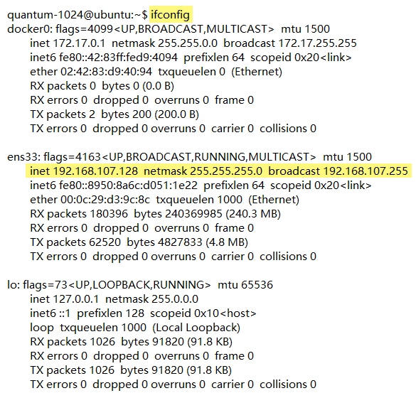
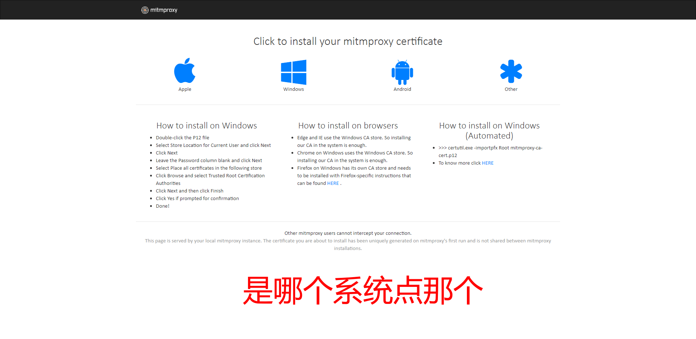
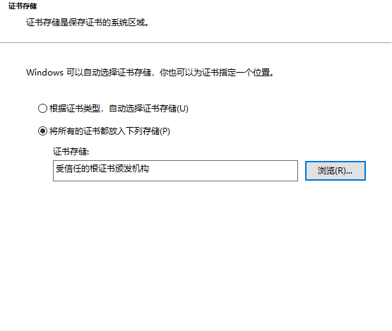
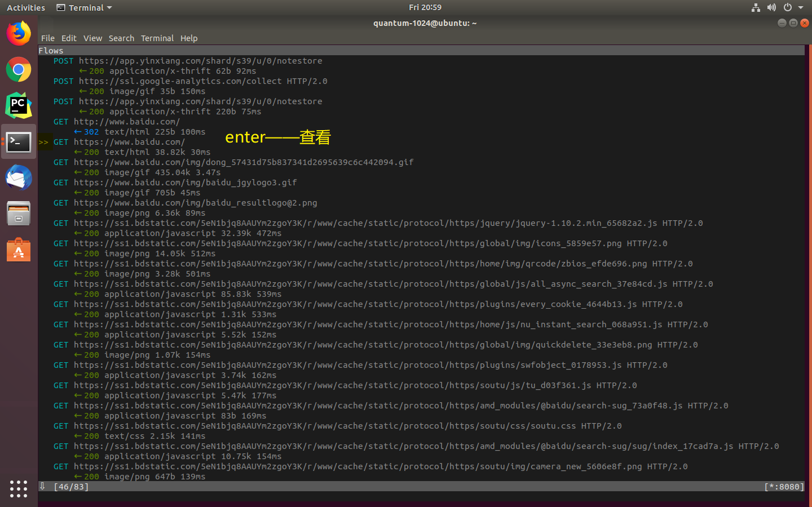
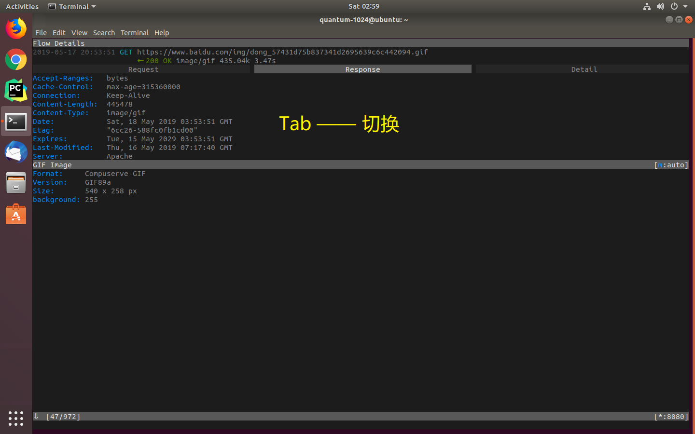
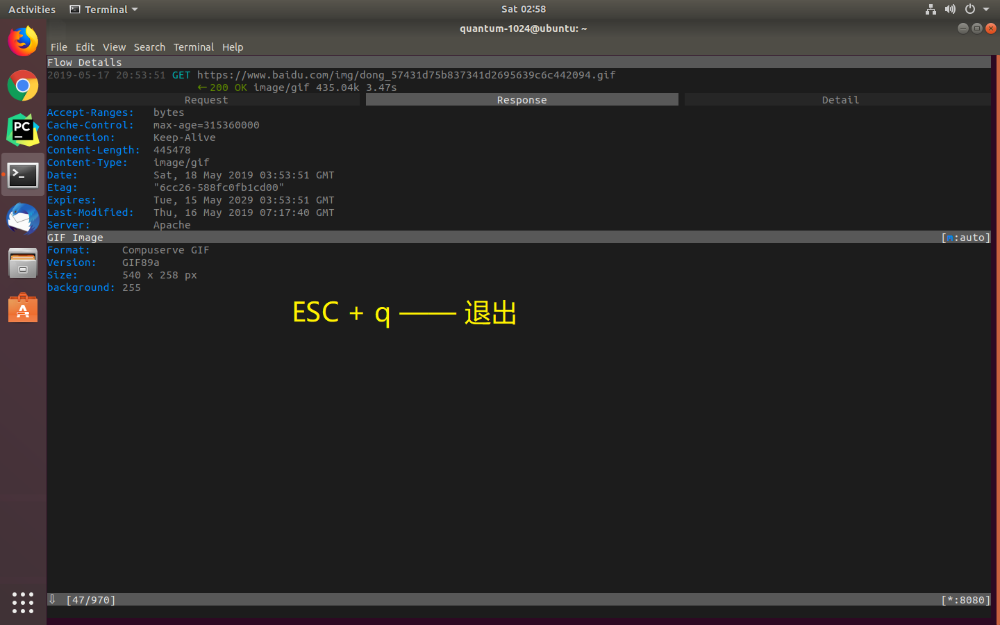

# Mitmproxy


1. 安装

- ubuntu

```bash
pip install mitmproxy

pip install pyyaml
```

<s>conda install --use-local mitmproxy-4.0.4-linux.tar.gz</s>

<s>conda install --use-local /home/quantum-1024/Downloads/mitmproxy-4.0.4-py3-none-any.whl</s>

<s>pip install /home/quantum-1024/anaconda3/pkgs/mitmproxy-4.0.4-linux.tar.gz</s>

```bash
pip install /home/quantum-1024/Downloads/mitmproxy-4.0.4-py3-none-any.whl
```

- centos

```bash
yum install gcc libffi-devel python-devel openssl-devel

pip install mitmproxy
```

2. 查看 ip



3. 添加代理


4. 安装证书

`mitm.it`




5. 导入证书




6. 查看



7. 切换



8. 退回



