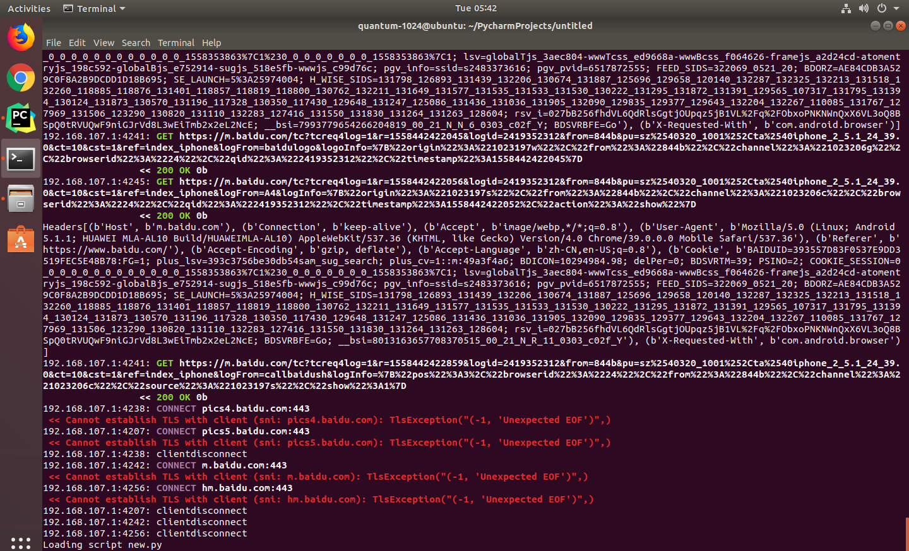

# Remote_client

1. 不要开启桥连


2. 查看虚拟机 IP


3. 修改模拟器 IP


4. 安装证书


5. 清空 mitmproxy


6. 过滤—— f


`!(~c 200)`——非 请求为200

`~d baidu.com`——请求跟 baidu 有关的

`~m post & ~u baidu.com`——所有 post 和 url 包含 baidu 的

7. 断点拦截—— i

`~d baidu.com & ~m get`——拦截 baidu 和 get 的请求


8. 修改 request —— e


9. 修改 response —— e


## mitmdump

1. mitmdump


2. `mitmdump -s new.py`


3. 打开 py 文件


4. 启动安卓模拟器，接收数据



5. 打印日志

 

```python
from mitmproxy import ctx

def request(flow):
	# print(flow.request.headers)
	ctx.log.info(str(flow.request.headers))
	ctx.log.warn(str(flow.request.headers))
	ctx.log.error(str(flow.request.headers))
```


```python
from mitmproxy import ctx


def request(flow):
    # print(flow.request.headers)
    ctx.log.info(str(flow.request.headers))
    ctx.log.warn(str(flow.request.url))
    ctx.log.warn(str(flow.request.host))
    ctx.log.error(str(flow.request.method))
    ctx.log.error(str(flow.request.path))


def response(flow):
    ctx.log.error(str(flow.response.status_code))
    ctx.log.error(str(flow.response.text))
```

