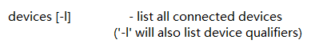
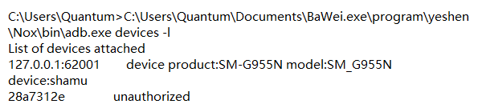

- 列出所有连接的设备

`C:\Users\Quantum\Documents\BaWei.exe\program\yeshen\Nox\bin\adb.exe devices -l`





- 安装软件

```bash
C:\Users\Quantum\Documents\BaWei.exe\program\yeshen\Nox\bin\adb.exe install C:\Users\Quantum\Downloads\app_aweGW_v6.2.0_197d363.apk
```

C:\Users\Quantum\Documents\BaWei.exe\program\yeshen\Nox\bin\adb.exe install app_aweGW_v6.2.0_197d363.apk

