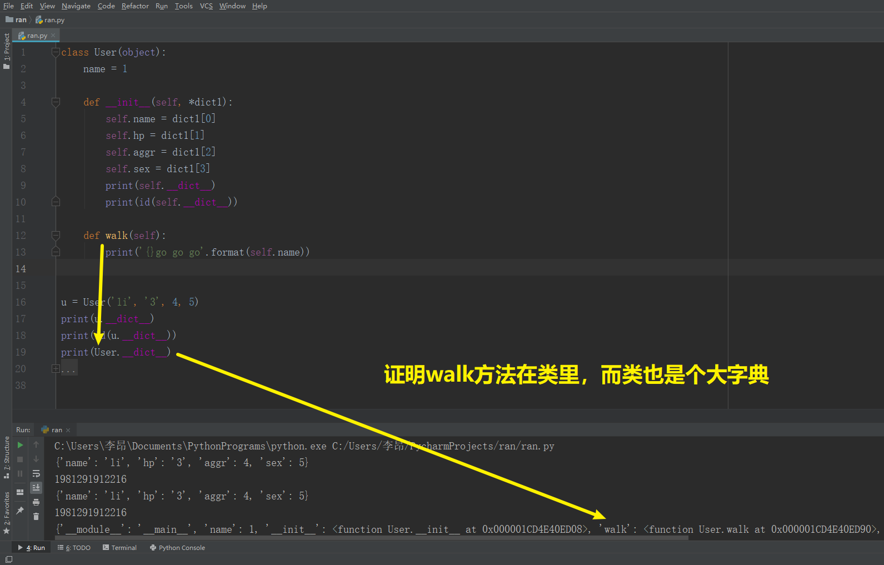

# class

## 面向对象

```python
def Person(*args, **kwargs):
    self = {}

    def attack(self, dog):
        dog['live_value'] -= self['aggressivity']

    def __init__(name, aggressivity, life_value):
        self['name'] = name
        self['aggressivity'] = aggressivity
        self['life_value'] = life_value
        self['attack'] = attack

    __init__(*args, **kwargs)
    return self


egg = Person('egon', 78, 10)
print(egg['name'])
```

## 类属性

相当于在类里面定义了一个变量

age是类的**静态属性**

```python
class User(Object):
	age
```

### 怎样调到属性

类名.属性`User.name`

### 怎样传参数

类后面的()，不是用来传参数的。而是用**__**init**__**(self):

```python
class User(object):  # User——类名
    age = 1  # 静态属性

    def __init__(self, *dict1):  # __init__——初始化方法
        self.name = dict1[0]  # 实例属性
        self.hp = dict1[1]
        self.aggr = dict1[2]
        self.sex = dict1[3]
        
    def walk(self, n):  # 类方法
        print('{} go go go {}米'.format(self.name, n))    
```

self像个dict能把**属性名**和**属性值**绑在一起。事实上也是。


### 对象 = 类名()

- 类名() 首先 创造出**self**变量
- 调用**__**init**__**方法，类名**()**里的参数会被这里接受
- 执行了**__**init**__**方法
- 返回时，return self = **对象**

## 类方法

### 怎样调用方法

- 类.方法(对象)



self的参数是必须有的


### 对象.方法() === 类.方法(对象)

不用再传对象参数了

### 怎样传参数

既然()里不用传对象了，那麽他能干嘛——传参数


- 动作——方法

- 值——属性

###### circle 属性：半径；两个方法：周长和面积

```python
from math import pi


class Circle:
    def __init__(self, R):
        self.R = R

    def zhouchang(self):
        Z = 2 * pi * self.R
        return '周长: {}'.format(Z)

    def mianji(self):
        S = pi * (self.R ** 2)
        return '面积: {}'.format(S)


c = Circle(3)
print(c.zhouchang())
print(c.mianji())

>>>
周长: 18.84955592153876
面积: 28.274333882308138
```

### isinstance & issubclass


# 命名空间

## 对于**不可变**数据类型，类变量最好用类名操作


## 对于**可变**数据类型，对象名的修改是共享的，重新赋值是独立的


###### 创建一个对象就计数

```python
class Foo:
	count = 0
	def __init__(self):
		Foo.count += 1
		
f1 = Foo()
f2 = Foo()
print(f1.count)
print(f2.count)

>>>
2
2
```

==**包**其实就是一个类==

# 组合

**有**的关系

一个对象的属性值是另一个类的对象

```python
class Dog:
    def __init__(self, name, aggr, hp, kind):
        self.name = name
        self.aggr = aggr
        self.hp = hp
        self.kind = kind

    def bite(self, person):
        person.hp -= self.aggr


class Person:
    def __init__(self, name, aggr, hp, sex, money):
        self.name = name
        self.aggr = aggr
        self.hp = hp
        self.sex = sex
        self.money = money

    def attack(self, dog):
        dog.hp -= self.aggr
        return dog.hp

    def get_weapon(self, weapon):
        if self.money >= weapon.price:
            self.weapon = weapon
            self.money -= weapon.price
            self.aggr += weapon.aggr
        else:
            return '余额不足'


alex = Person('alex', 5, 100, '不详', 0)
jin = Dog('金老板', 100, 500, 'teddy')


# 装备：名字、伤害、加血量
class Weapon:
    def __init__(self, name, aggr, njd, price):
        self.name = name
        self.aggr = aggr
        self.njd = njd
        self.price = price

    def hand18(self, dog):
        if self.njd > 0:
            dog.hp -= self.aggr * 2
            self.njd -= 1
            return self.aggr * 2


bang = Weapon('打狗棒', 100, 3, 998)
# alex装备打狗棒
alex.money += 1000
alex.get_weapon(bang)
print(alex.weapon.name)
print(alex.aggr)
print(alex.attack(jin))
print(alex.weapon.hand18(jin))
print(jin.hp)
```


alex.weapon 是 Weapon类的对象——`alex.weapon.hand18(jin)`

###### 圆环类 用上组合

```python
from math import pi


class Circle:
    def __init__(self, R):
        self.R = R

    def perimeter(self):
        Z = 2 * pi * self.R
        return Z

    def area(self):
        S = pi * (self.R ** 2)
        return S


c = Circle(3)


class Ring:
    def __init__(self, outside_r, inside_r):
        self.outside_c = Circle(outside_r)
        self.inside_c = Circle(inside_r)

    def area(self):
        return self.outside_c.area() - self.inside_c.area()

    def perimeter(self):
        return self.outside_c.perimeter() + self.inside_c.perimeter()


ring = Ring(20, 10)
print(ring.area())
print(ring.perimeter())

>>>
942.4777960769379
188.49555921538757
```

# 继承

**是**的关系

有相同的代码——用继承

## 查看继承


- 父类中没有的属性，在子类中出现——派生属性

- 父类中没有的方法，在子类中出现——派生方法

- 只要是子类的对象调用，子类中有名字的，一定用子类的，没有再找父类

- 如果还想用父类的，单独调用父类的，==需要自己传self参数==

## 既想用自己的还想继承父类的


## super()


## 多继承

### 广度一样——从左到右


### 钻石继承


### 漏斗继承


### super的本质

不是直接找父类，而是根据继承节点顺序来的。


# 多态

python崇尚鸭子类型

不崇尚根据继承所得来的相似

我只是自己实现我自己的代码就可以了

如果两个类刚好相似，并不产生父类的子类的兄弟关系，而是鸭子类型

不是硬性规范，全凭自觉。

低耦合，每个相似的类之间都没有影响

但太随意。

# 封装

- 代码的保护。
- 属性和方法都藏起来不让你看见。

## **__**


## @property


property $\rightleftharpoons$ 属性

==比原来少写了个()==

- @bmi.setter——修改
- @bmi.deleter——删除

## @staticmethod

static $\rightleftharpoons$ 静态

在完全面向对象的程序中，如果一个函数 既和对象没关系 也和类没有关系 那么就用staticmethod将这个函数变成一个静态方法


## @classmethod

这个方法只涉及静态属性的时候，就应该使用classmethod来装饰这个方法


# 接口类 VS 抽象类

| 接口类                                       | 抽象类                                           |
| -------------------------------------------- | ------------------------------------------------ |
| python原生不支持                             | python原生支持的                                 |
| 默认多继承，所有的方法都必须，不能实现(pass) | 不支持多继承，抽象类中的方法可以有一些方法的实现 |
| 不能实例化                                   | 不能实例化                                       |


```python
from abc import abstractclassmethod, ABCMeta


class Payment(metaclass=ABCMeta):
    """
    metaclass——元类，默认你创建类的类 type
    metaclass=ABCMeta——类的规范
    """

    @abstractclassmethod
    def pay(self, money):
        pass


class Wechat(Payment):
    def pay(self, money):
        print('使用微信支付{}元'.format(money))


class Ali(Payment):
    def pay(self, money):
        print('使用支付宝支付{}'.format(money))


class Apple(Payment):
    def fuqian(self, money):
        print('使用apple支付{}'.format(money))

    # def pay(self, money):
    #     print('使用apple支付{}'.format(money))


def pay(pay_obj, money):
    pay_obj.pay(money)


w = Wechat()
a = Ali()
apl = Apple()
w.pay(100)
pay(a, 300)
pay(apl, 300)
```

# 反射

- 用字符串类型的名字，去操作变量

- 随让他跟eval很想但是没有安全隐患
- 调用了自己的函数

## hasattr & getattr

- 对象名获取对象属性和普通方法

- 方法要调用


- 类名获取静态属性、类方法、静态方法


- 模块的属性、方法


## delattr

删除修改变量

## setattr

设置修改变量

# 内置方法

## **__**str**__**


## **__**repr**__**

是上面的备胎

# 单例模式

一个类始终只有一个模式

主要是控制**__**new**__**() 永远是自己


