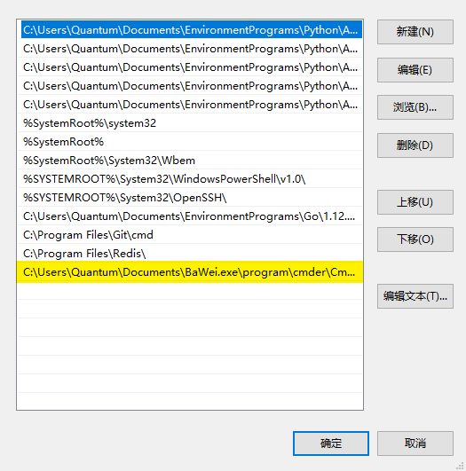
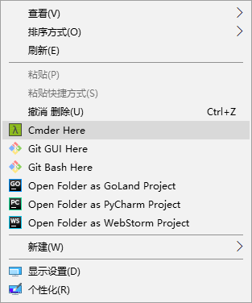
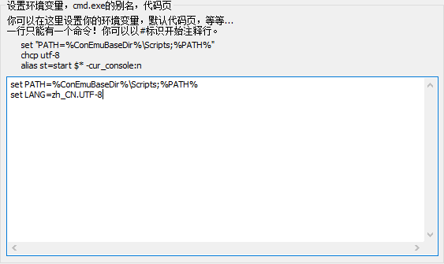
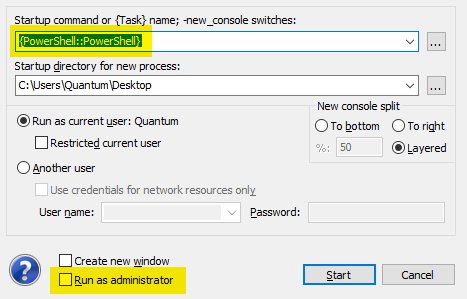

# Cmder

1. 加入 Path

`C:\Users\Quantum\Documents\BaWei.exe\program\cmder\Cmder.exe`

2. 配置右键快捷启动

**以管理员身份打开 cmder**

`Cmder.exe /REGISTER ALL`

3. 显示中文

`set LANG=zh_CN.UTF-8`

4. **CTRL + t**——新建窗口

## WSL

[ubuntu](<https://docs.microsoft.com/zh-cn/windows/wsl/install-win10>)

