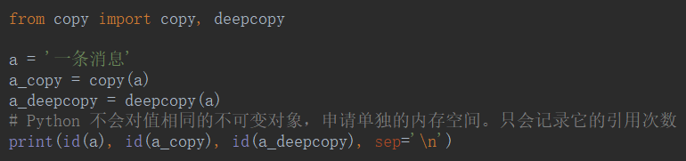
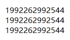
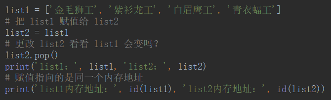
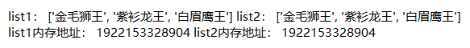
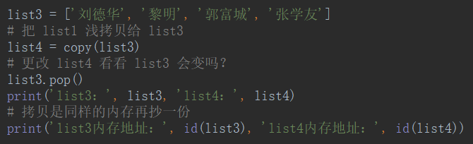
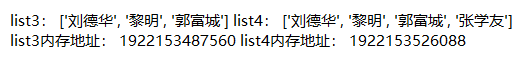
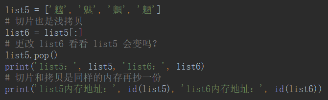
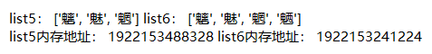
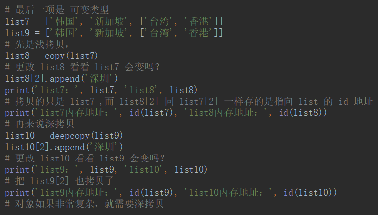
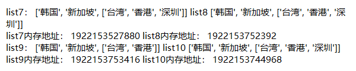

# 浅拷贝VS深拷贝

Python 内**不可变**对象的内存管理方式是引用计数。所以讨论的拷贝都是基于可变类型。





## 赋值





## 浅拷贝





### 切片也是浅拷贝





## 深拷贝





```python
from copy import copy, deepcopy

list1 = ['金毛狮王', '紫衫龙王', '白眉鹰王', '青衣蝠王']
# 把 list1 赋值给 list2
list2 = list1
# 更改 list2 看看 list1 会变吗？
list2.pop()
print('list1：', list1, 'list2：', list2)
# 赋值指向的是同一个内存地址
print('list1内存地址：', id(list1), 'list2内存地址：', id(list2))

list3 = ['刘德华', '黎明', '郭富城', '张学友']
# 把 list1 浅拷贝给 list3
list4 = copy(list3)
# 更改 list4 看看 list3 会变吗？
list3.pop()
print('list3：', list3, 'list4：', list4)
# 拷贝是同样的内存再抄一份
print('list3内存地址：', id(list3), 'list4内存地址：', id(list4))

list5 = ['魑', '魅', '魍', '魉']
# 切片也是浅拷贝
list6 = list5[:]
# 更改 list6 看看 list5 会变吗？
list5.pop()
print('list5：', list5, 'list6：', list6)
# 切片和拷贝是同样的内存再抄一份
print('list5内存地址：', id(list5), 'list6内存地址：', id(list6))

# 最后一项是 可变类型
list7 = ['韩国', '新加坡', ['台湾', '香港']]
list9 = ['韩国', '新加坡', ['台湾', '香港']]
# 先是浅拷贝，
list8 = copy(list7)
# 更改 list8 看看 list7 会变吗？
list8[2].append('深圳')
print('list7：', list7, 'list8', list8)
# 拷贝的只是 list7 ,而 list8[2] 同 list7[2] 一样存的是指向 list 的 id 地址
print('list7内存地址：', id(list7), 'list8内存地址：', id(list8))
# 再来说深拷贝
list10 = deepcopy(list9)
list10[2].append('深圳')
# 更改 list10 看看 list9 会变吗？
print('list9：', list9, 'list10', list10)
# 把 list9[2] 也拷贝了
print('list9内存地址：', id(list9), 'list10内存地址：', id(list10))
# 对象如果非常复杂，就需要深拷贝
```

