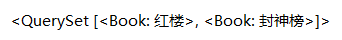

# F

查询出库存数大于卖出数的所有书 *之前都是一个字段和常量比较，这个是两个字段作比较*

```python
from django.db.models import F

Book.objects.filter(inventory__gt=F('sales_volume'))

```



刷单 卖出书✖3

```python
from django.db.models import F

Book.objects.update(sales_volume=(F('sales_volume') * 3))
```

==update 必须用与 queryset==

# Q

查询 卖出书大于1000，**and** 价格小于100 的书

```python
Book.objects.filter(sales_volume__gt=1000, price__lt=100)
```

查询 卖出书大于1000，**or** 价格小于100 的书

```python
from django.db.model import Q

print(Book.objects.filter(Q(sales_volume__gt=1000) | Q(price__lt=100)))
```

