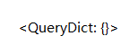

# Request

- path_info——返回用户访问 **url**，不包括域名

-  method——请求中使用的 HTTP **方法**的字符串表示，**全大写**表示

- GET——包含所有 HTTP **GET** 参数的类字典对象

`url = 127.0.0.1:8000/edit_book/?id=1&name=yimi`

- POST——包含所有 HTTP **POST** 参数的类字典对象

- 请求数据

<table>
    <tr>
    	<td></td>
        <td>request.GET</td>
        <td>request.POST</td>
    </tr>
    <tr>
    	<td>GET 请求</td>
        <td>有</td>
        <td>可能有</td>
    </tr>
    <tr>
    	<td>POST 请求</td>
        <td>无</td>
        <td>有</td>
    </tr>
</table>

- body——请求体，**byte** 类型 request.POST 的数据就是从 body 里面提取到的

- FILES——上传文件

- scheme——返回是什么网络协议 *http;https*

scheme$_{skēm}$—方案

# Response

- HttpResponse——返回字符串内容

- render——返回一个html页面

- redirect——返回一个重定向 *告诉浏览器，再去访问另一个网址*

- django.http.JsonResponse()——序列化

