## URLconf=Re_path

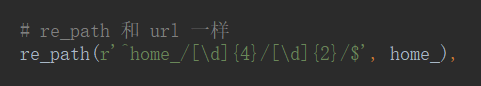

- 分组——正则匹配后，可以当参数传进函数来

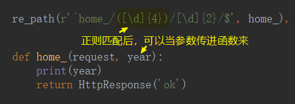

- 分组命名——还可以默认值传参

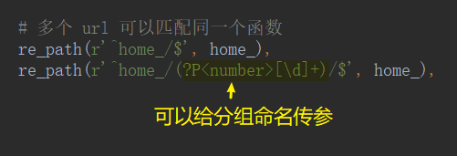

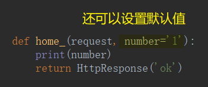

- include——app 就是要把功能分开，所以比 app 还多的 url 也因该分开

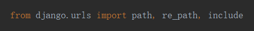

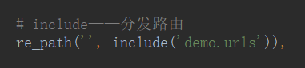

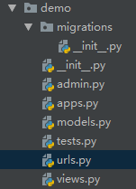

- `name='【别名】'` ——给 url 起个别名，然后通过别名拿到具体的 url

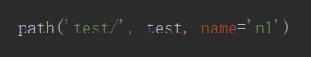

- `reverse('【别名】')`——反向解析

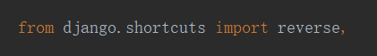

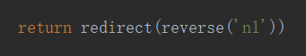

- `reverse('【别名】', args=(【参数】,【参数】))`——根据分组函数反向解析带参数

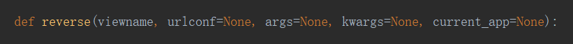

- `reverse('【别名】', kwargs=(【形参:实参】,【形参:实参】))`——根据命名分组函数反向解析带参数

- ``——模板

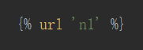

- ``——参数模板

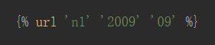

- ``——关键字模板

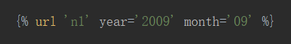

# 例子

## 路由命名冲突

不同的 app 有可能产生相同路由名字

1. `include('app01.urls', namespace='app01')`——给分发来个命名空间

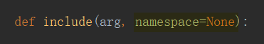

2. `reverse('app01:home')`——根据 namespace 来区分 viewname

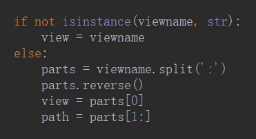

## 删除合一

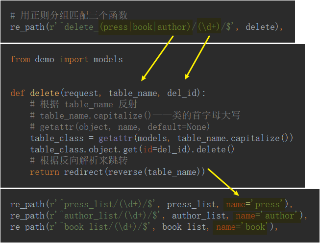

