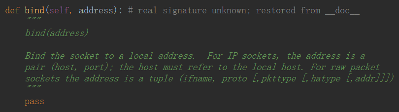
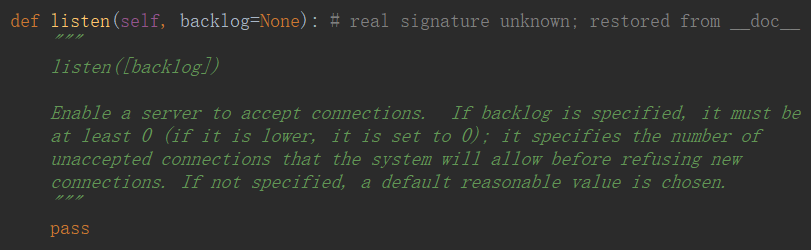
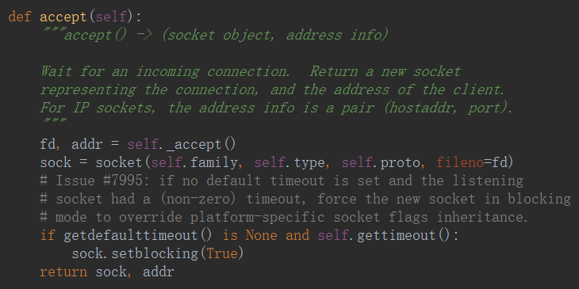
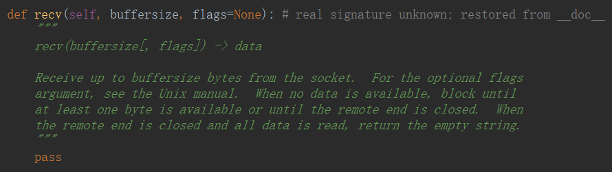
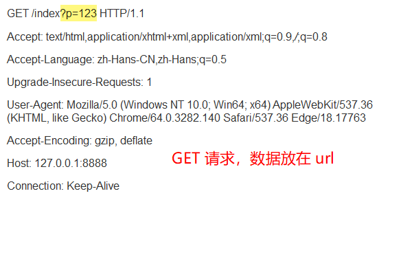
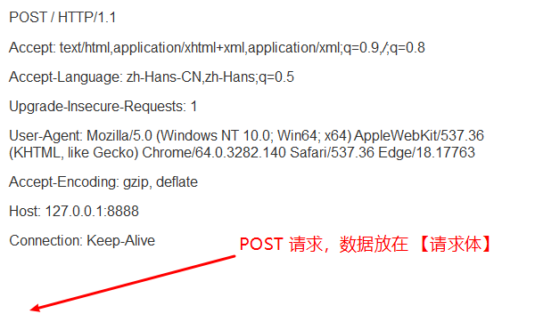
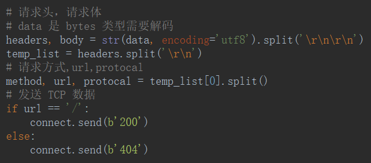
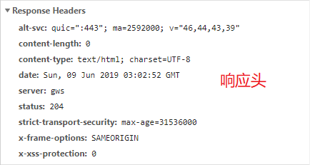
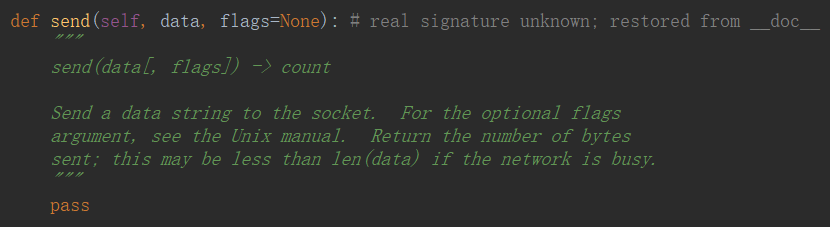

# Socket

- 浏览器——socket client

- 网站——socket server

## 服务端

- `socket.socket()`——创建实例

- `socket.bind((【host,port】))`——绑定地址（host,port）到套接字， 在 AF_INET 下，元组（host,port）的形式表示地址。

- `socket.listen(【backlog】)`——开始TCP监听。backlog 指定在拒绝连接之前，操作系统可以挂起的最大连接数量。该值至少为1，大部分应用程序设为5就可以了。

- `socket.accept()`——被动接受TCP客户端连接（阻塞式）等待连接的到来

- `connect.recv(【bufsize】)`——接收 TCP 数据，数据以字符串形式返回，bufsize 指定要接收的最大数据量。flag 提供有关消息的其他信息，通常可以忽略。

- GET 请求头

- POST 请求头

- 根据 url 去往不同的网页

- 响应头

- 响应体——用户看到的数据

- `connect.send(【data】)`——发送 TCP 数据，将 string 中的数据发送到连接的套接字。返回值是要发送的字节数量，该数量可能小于 string 的字节大小。

## 客户端

