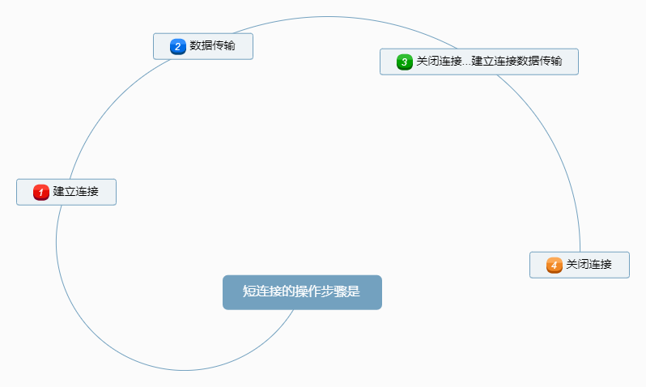
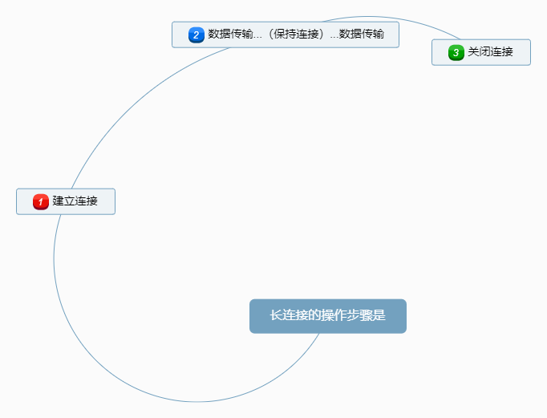

# 长连接VS短链接

- 从HTTP/1.1起，默认使用长连接，用以保持连接特性。使用长连接的HTTP协议，会在响应头加入这行代码：`Connection:keep-alive`

- Keep-Alive 不会永久保持连接，它有一个保持时间，可以在不同的服务器软件（如Apache）中设定这个时间。实现长连接需要客户端和服务端都支持长连接。

- HTTP协议的长连接和短连接，实质上是TCP协议的长连接和短连接。

