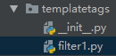
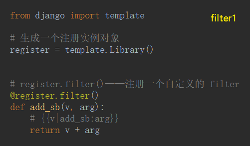
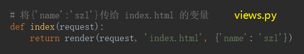
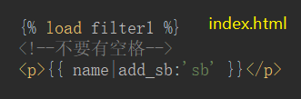

# Filters

- 语法

`{{【变量|方法名:'参数'】}}`

- `{{xxx | default:'nothing'}}`——如果 xxx 无效 就显示 nothing

- `{{file | filesizeformat}}`——显示文件大小

- `{{value | truncatechars:9 }}`——多出的字符数量，会被截断。以‘…’代替。

- `{{value|date:'Y-m-d H:i:s'}}`——日期格式化

- `{{value:safe}}`——这段代码安全不必做转义

- 自定义一个 filter 装饰器

1. 在 app 下新建一个名叫 templatetags 的 Python Package 的包

2. 将`{'name':'szl'}`传给 html 的变量

3. 在 html 文件中加载 ``

