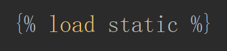
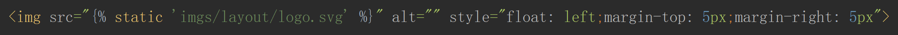
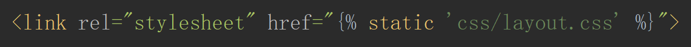
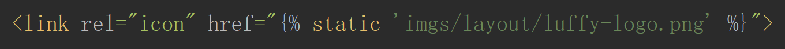
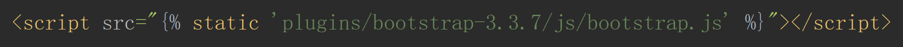
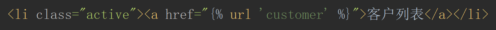
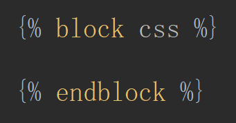
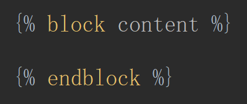
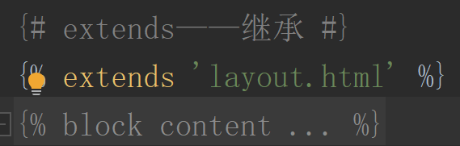

# 的一系列操作

- static 文件夹

1. ``——导入 static

2. ``——导入 css js images 文件

- ``——反向解析

- ``——母板

- ``——继承

<ol>
    <li><a href='Filters'>Filters</a>——记住几个简单的</li>
    <li><a href='simple_tag'>simple_tag</a></li>
    <li><a href='Inclusion_tag'>Inclusion_tag</a>——类似组件，因为必须占用一个html页面</li>
</ol>

