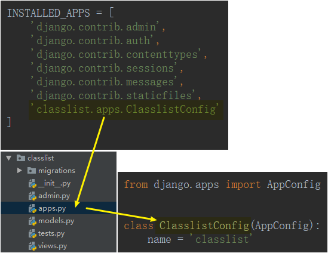
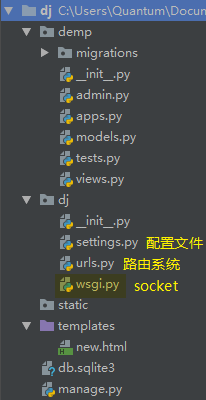

# 创建项目&启动项目&项目目录&配置文件

- 创建项目

```python
django-admin startproject 【项目名】
```

- 创建应用

1. 

```python
python manage.py startapp 【应用名字】
```

2. 添加到 INSTALLED_APPS 列表

    

- 启动项目

```bash
python manage.py runserver 【端口】
```

- 项目目录



- 配置文件

<ol>
    <li><a href='静态文件及模板配置'>静态文件及模板配置</a></li>
    <li><a href='MySQL连接'>MySQL连接</a></li>
</ol>

