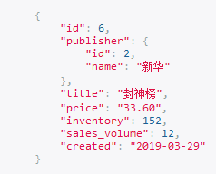

[TOC]

# 多对多查询

关联管理器

```python
from django.db import models
from datetime import datetime


# Create your models here.
class Publisher(models.Model):
    name = models.CharField(max_length=32, unique=True)

    def __str__(self):
        return self.name


class Book(models.Model):
    title = models.CharField(max_length=32, unique=True)
    price = models.DecimalField(max_digits=6, decimal_places=2, verbose_name='价格')
    inventory = models.IntegerField(default=0)
    sales_volume = models.IntegerField(default=0)
    created = models.DateField(default=datetime.now)
    publisher = models.ForeignKey(to='Publisher', null=True, on_delete=models.SET_NULL)

    def __str__(self):
        return self.title


class Author(models.Model):
    name = models.CharField(max_length=32)
    book = models.ManyToManyField(to='Book')

    def __str__(self):
        return self.name

```

## create()

通过作者创建书

```python
Author.objects.first().book.create(title='封神榜', publisher_id=2, price=33.6, inventory=152, sales_volume=12)
```



## add()

一个作者关联多本书

```python
book_obj = Book.object.get(id=4)
author_obj.book.add(book_obj)
```

添加多个

==把列表打散==

```python
book_queryset = Book.objects.filter(id__range=[2, 3])
author_obj.book.add(*book_queryset)
```

## set()

书籍设置多个作者

```python
book_obj = Book.objects.first()
book_obj.author.set([2, 3])
```

## remove()

删除关系

```python
book_obj = Book.objects.get(id=9)
author_obj.book.remove(book_obj)
```

