# 学员管理

- 建库

```mysql
create database school charset=utf8;
```

- 建表

constraint——约束

```mysql
create table class(id int primary key auto_increment not null,title varchar(255))engine=innodb default charset=utf8;

create table student(id int primary key auto_increment not null,name varchar(255),class_id int,constraint stu_cla_id_fk foreign key(class_id) references class(id))engine=innodb default charset=utf8;

create table teacher(id int primary key auto_increment not null,name varchar(255))engine=innodb default charset=utf8;

create table teacher_class(id int primary key auto_increment not null,teacher_id int,class_id int)engine=innodb default charset=utf8;
```

- 插入数据

```mysql
insert into class(title) values ("math");
insert into class(title) values ("english");
insert into class(title) values ("art");
```

```mysql
insert into student(name,class_id) values ("xiaoming","3");
insert into student(name,class_id) values ("szl","3");
insert into student(name,class_id) values ("sunjiu","1");
insert into student(name,class_id) values ("章士通","1");

```

- 查询数据

```mysql
select student.id,student.name,class.title from student left join class on student.class_id=class.id;
```

## class

- 查

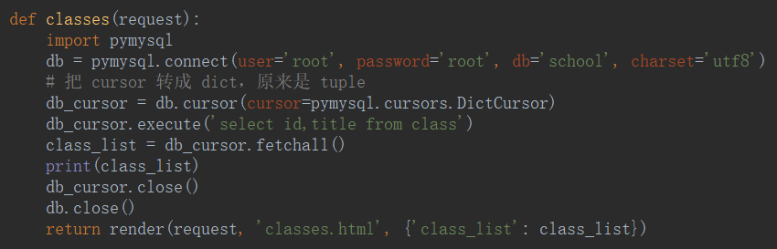

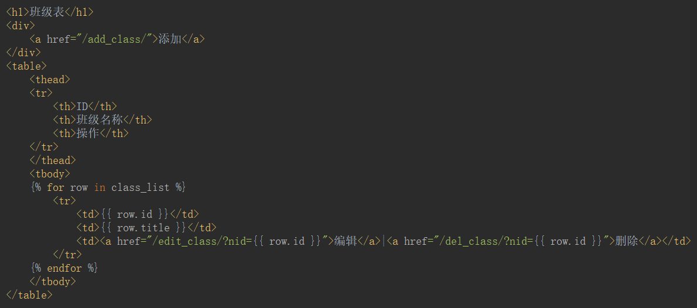

- 增

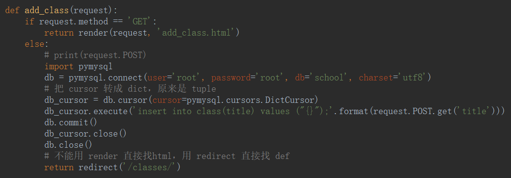

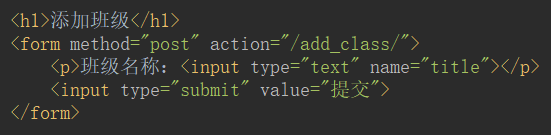

- 删

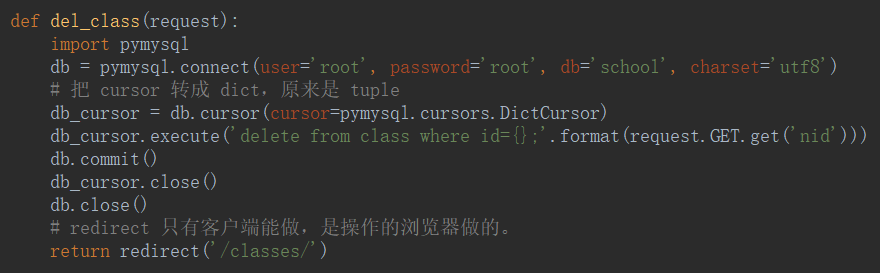

- 改

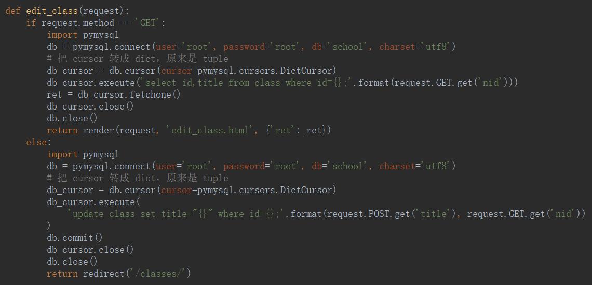

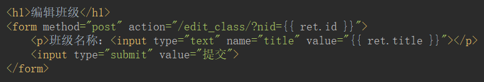

## student

- 增

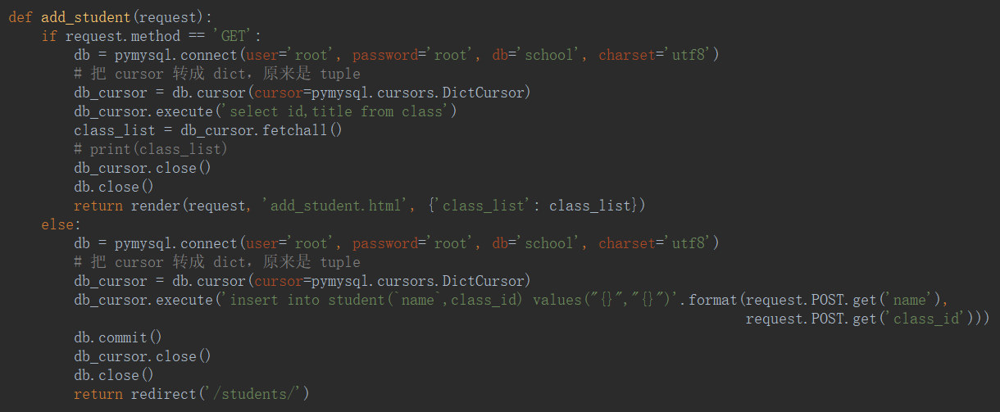

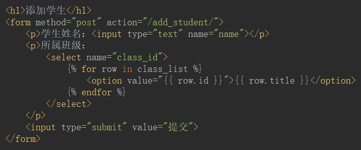

- 改

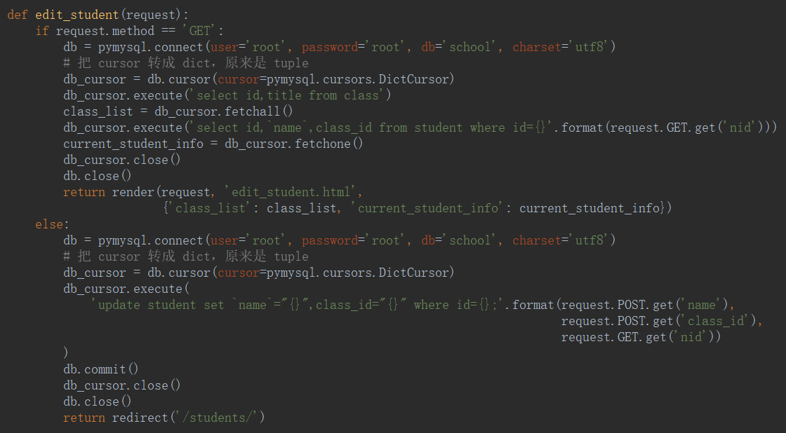

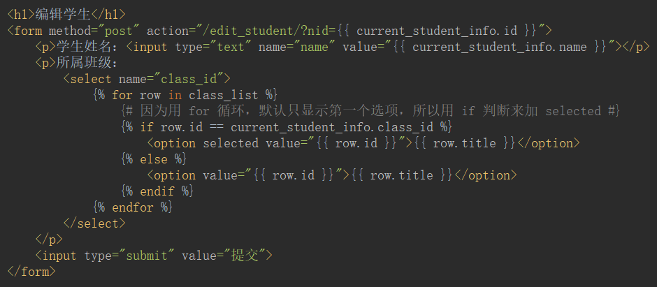

