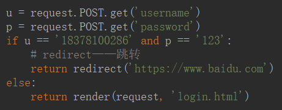

# 用户登录示例

- 获取用户提交方式

- 获取用户提交数据

- `redirect(【url】)`——跳转页面
- `render(【模板】)`——模板渲染

- 请求数据

<table>
    <tr>
    	<td></td>
        <td>request.GET</td>
        <td>request.POST</td>
    </tr>
    <tr>
    	<td>GET 请求</td>
        <td>有</td>
        <td>可能有</td>
    </tr>
    <tr>
    	<td>POST 请求</td>
        <td>无</td>
        <td>有</td>
    </tr>
</table>

