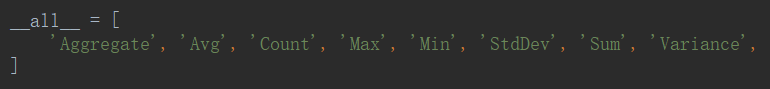

[TOC]

# 聚合查询和分组查询

```python
from django.db import models
from datetime import datetime


# Create your models here.
class Publisher(models.Model):
    name = models.CharField(max_length=32, unique=True)

    def __str__(self):
        return self.name


class Book(models.Model):
    title = models.CharField(max_length=32, unique=True)
    price = models.DecimalField(max_digits=6, decimal_places=2, verbose_name='价格')
    inventory = models.IntegerField(default=0)
    sales_volume = models.IntegerField(default=0)
    created = models.DateField(default=datetime.now)
    publisher = models.ForeignKey(to='Publisher', null=True, on_delete=models.SET_NULL)

    def __str__(self):
        return self.title


class Author(models.Model):
    name = models.CharField(max_length=32)
    book = models.ManyToManyField(to='Book')

    def __str__(self):
        return self.name
```

## 聚合查询

aggregate $\rightleftharpoons​$ 合计的



所有书的价格求平均值

==所有书因该就是聚合的体现==

```python
from django.db.models import *

Book.objects.all().aggregate(aggregates.Avg('price'))
```


## 分组查询

查询每一本书的作者个数

```python
from django.db.models import *

ret = Book.objects.all().annotate(aggregates.Count('author'))
for i in ret:
    print(i.author__count)

```


