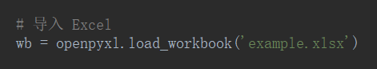
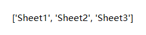
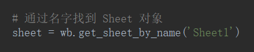
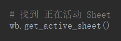
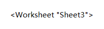
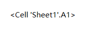
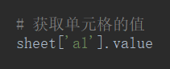
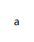
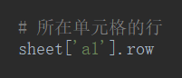
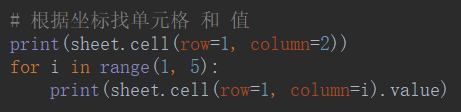

# Excel

~~`pip install xlrd xlwt xlutils`~~

```bash
pip install openpyxl
```

导入 Excel



## 从工作簿取工作表

获取所有 Sheet 的名字




通过名字找到 Sheet 对象



获得 Sheet 名字


找到 正在活动 Sheet





获取正在活动 Sheet 的 名称


## 从工作表取单元格

获取单元格




获取单元格的值





所在单元格的行




所在单元格的列


所在单元格的坐标

coordinate$_{扣抵内特}$——坐标


根据坐标找单元格 和 值




