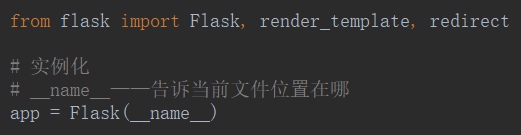
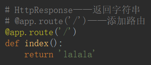
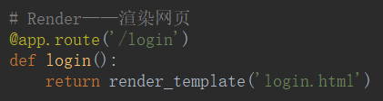
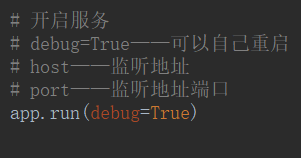
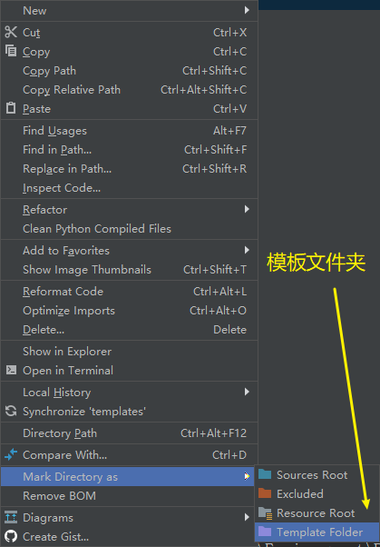
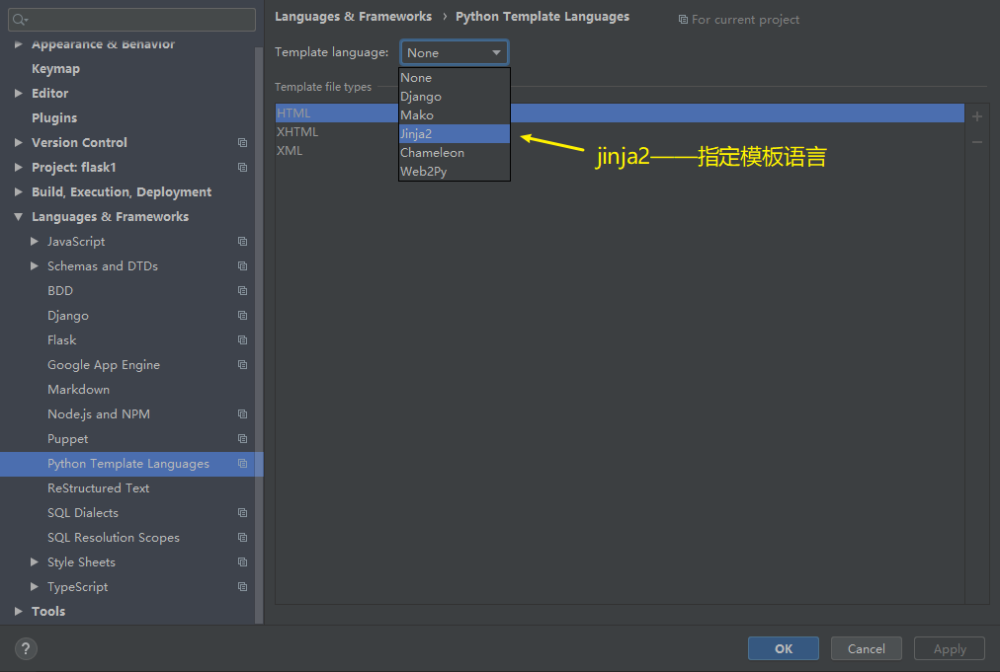

# Flask三剑客

```python
from flask import Flask, render_template, redirect

# 实例化
# __name__——告诉当前文件位置在哪
app = Flask(__name__)


# HttpResponse——返回字符串 & Redirect——跳转路径
# @app.route('/')——添加路由
@app.route('/')
def index():
    # return 'lalala'
    return redirect('/login')


# Render——渲染网页
@app.route('/login')
def login():
    return render_template('login.html')


# 开启服务
# debug=True——可以自己重启
# host——监听地址
# port——监听地址端口
app.run(debug=True)
```

## 实例化



## 响应

- HttpResponse



- Redirect


- Render



## 运行



- `debug=True`——可以自己重启

- `host`——监听地址

- `port`——监听地址端口

## 创建模板文件夹





