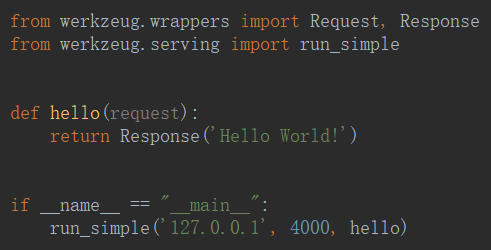
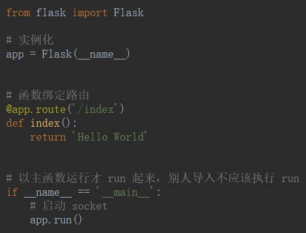

# 创建项目

- wsgi——web服务网关接口

- werkzurg——Flask依赖的wsgi

```python
from werkzeug.wrappers import Request, Response


def hello(request):
    return Response('Hello World!')


if __name__ == "__main__":
    from werkzeug.serving import run_simple


    run_simple('127.0.0.1', 4000, hello)
```



- 创建



