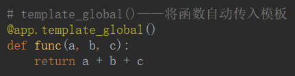
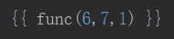
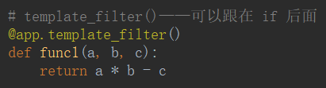
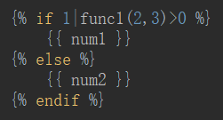
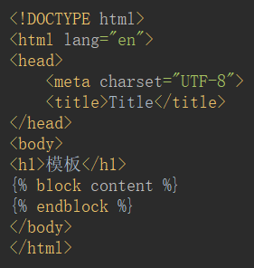
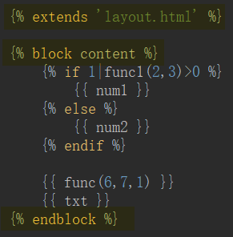
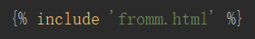
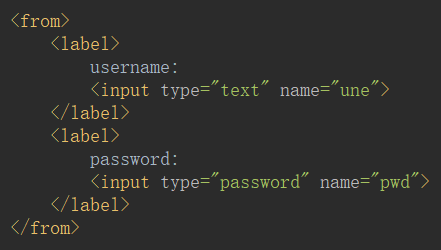
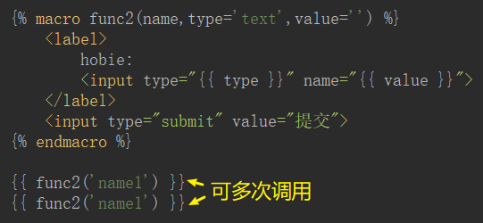

# 模板渲染

## 后端给前端传入函数

- `@app.template_global()`——将函数自动传入模板





- `@app.template_filter()`——可以跟在 if 后面





## 模板继承

- `extends`——html 模板继承

```html





```





- `include`——html 导入

```html

```





## 宏定义



