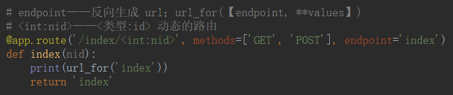
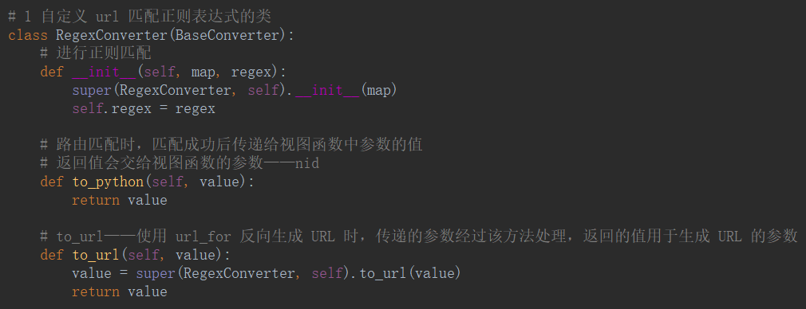
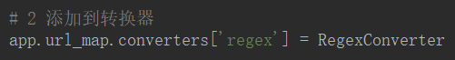
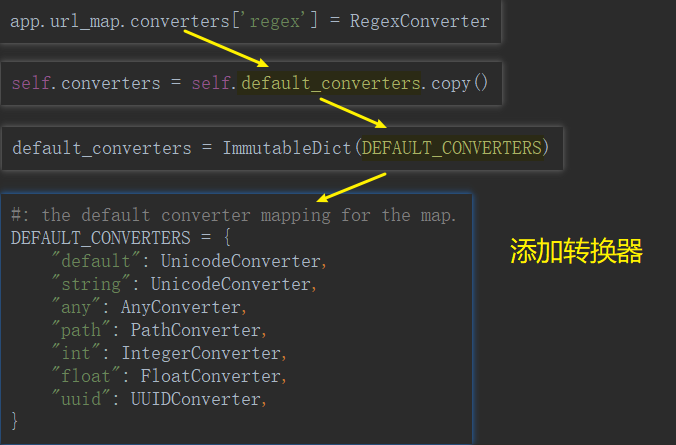
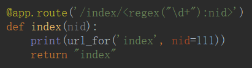

# 路由系统

- `endpoint`——给路由起名字
- `url_for(【endpoint, **values】)`——反向生成 url

- `/<int:nid>`——动态路由 



- `redrect_to='/url/<int:id>'`——重定向

- `subdomain='<username>'`——访问子域名

## 自定义 url 匹配正则表达式

1. 自定义 url 匹配正则表达式的类

```python
class RegexConverter(BaseConverter):
    # 进行正则匹配
    def __init__(self, map, regex):
        super(RegexConverter, self).__init__(map)
        self.regex = regex

    # 路由匹配时，匹配成功后传递给视图函数中参数的值
    # 返回值会交给视图函数的参数——nid
    def to_python(self, value):
        return value

    # to_url——使用 url_for 反向生成 URL 时，传递的参数经过该方法处理，返回的值用于生成 URL 的参数
    def to_url(self, value):
        value = super(RegexConverter, self).to_url(value)
        return value
```



2. 添加到转换器

```python
app.url_map.converters['regex'] = RegexConverter
```





3. 



