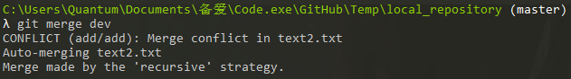
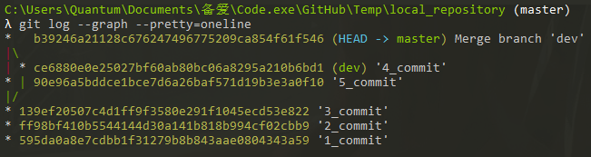
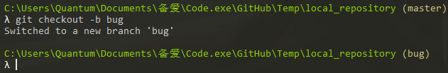
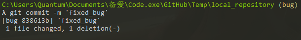
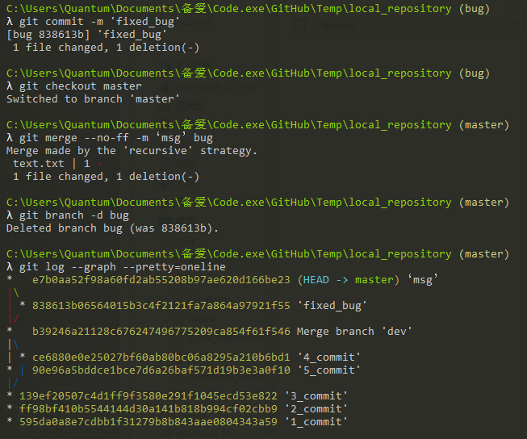

# Branch

## 冲突

> 几个分支操纵同一个文件

`git log --graph --pretty=oneline`——查看分支图

## Recursive 策略

> 各分支操纵不同文件

- `git merge 【branch】`——不会快速合并，但是可以自动进行合并并提交，和添加信息

## BUG 分支

1. 先建立一个临时的分支

2. 修复完 bug 进行提交

   

3. 主动选择 Recursive策略

- `git merge --no-ff -m ‘msg’ 【branch】`——Recursive

