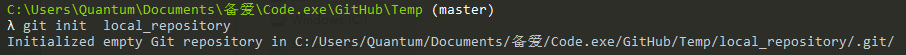

# Git

[Git](<http://ndpsoftware.com/git-cheatsheet.html#loc=workspace;>)

<ol>
    <li><a href='Stash'>Stash</a></li>
    <li><a href='Workspace'>Workspace</a></li>
    <li><a href='Index'>Index</a></li>
    <li><a href='Local_Repository'>Local_Repository</a></li>
    <li><a href='Upstream_Repository'>Upstream_Repository</a></li>
    <li><a href='Branch'>Branch</a></li>
</ol>

- `git init 【local repository name】`——建立一个新的本地库

