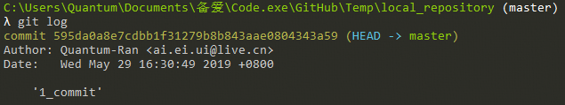
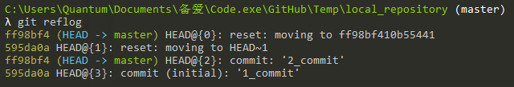
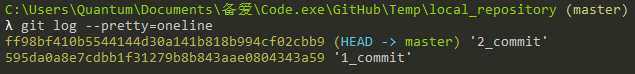
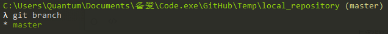
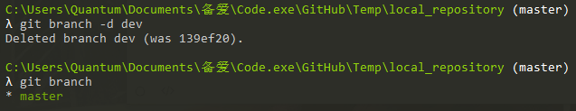

# Local_Repository

## 查

- `git log`——查看提交版本记录

- `git reflog`——查看操作记录

- `git log --pretty=oneline`

- `git branch`——查看所有分支

- `git diff HEAD HEAD^ -- 【file】`——两个版本有何不同

## 删

- `git branch -d 【branch】`——删除分支

