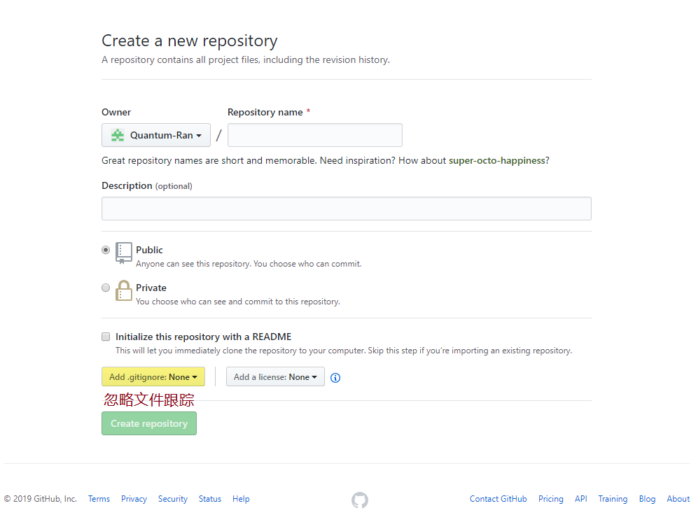
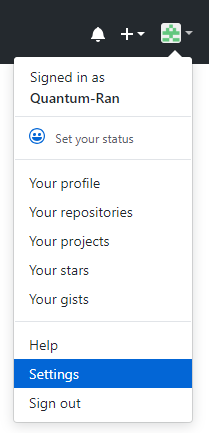
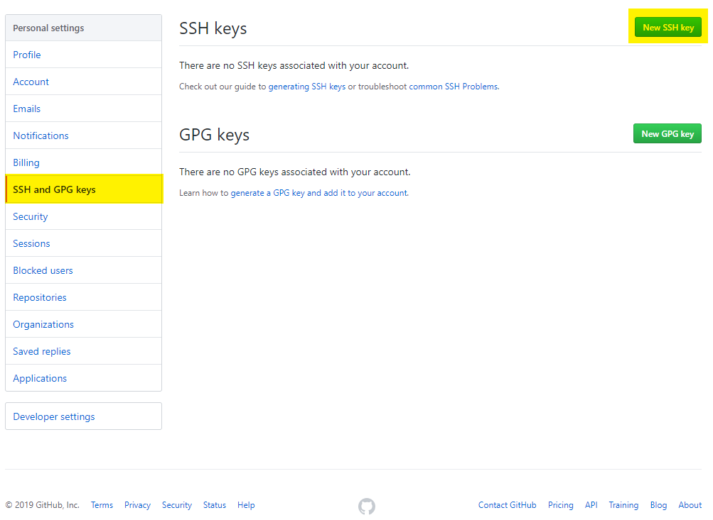
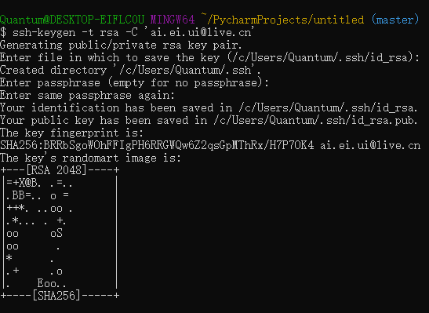
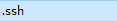
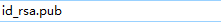
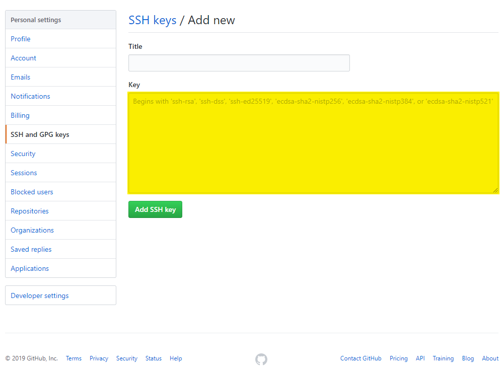
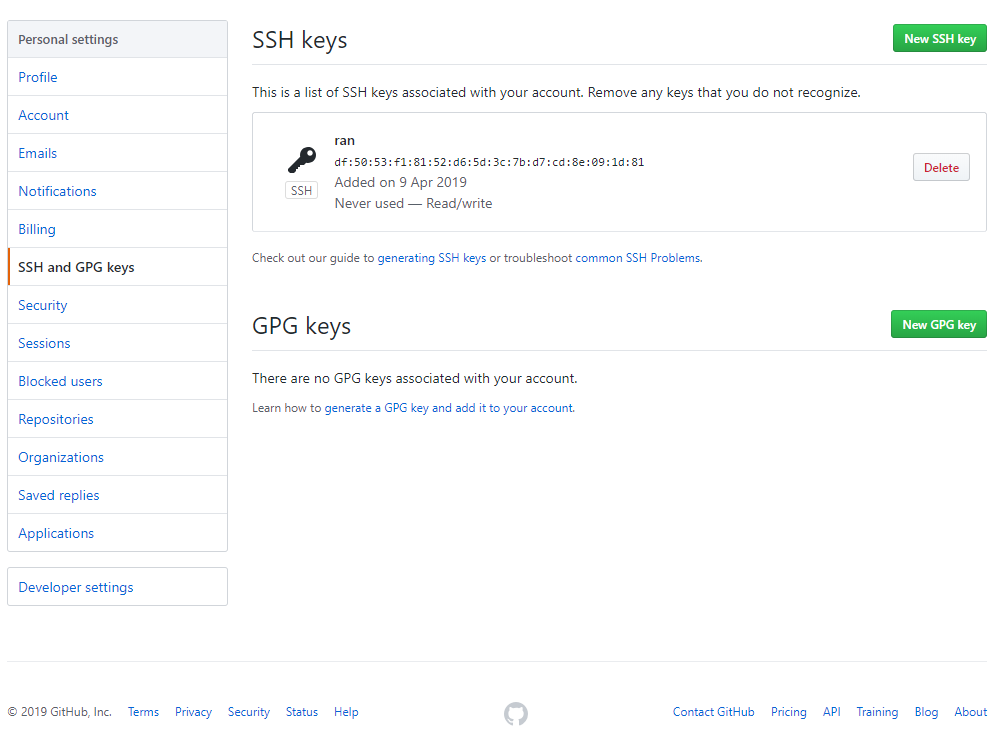
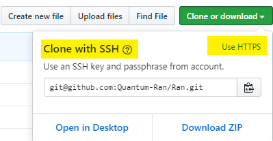

## 创建仓库



## 添加 SSH 账户





### 生成 SSH 公钥

```bash
ssh-keygen -t rsa -C 'ai.ei.ui@live.cn'
```













## github 克隆

```bash
git clone git@github.com:Quantum-Ran/Ran.git
```

## 如果克隆出错

```bash
eval '$(ssh-agent -s)'

ssh-add
```

切入新目录

# 推送

```bash
git push origin 【分支名】
```

### 出错

```bash
git remote add origin git@github.com:【为github注册名】/【远程仓库名】.git

git remote add origin git@github.com:Quantum-Ran/Ran.git
```

## 跟踪远程的分支

```bash
git branch --set-upstream-to=origin/【远程分支】 【本地分支】

git push
```

## 拉取远程分支代码

```bash
git pull origin 【远程分支名】
```

# master dev

Master——发布的代码

Dev——开发的代码

