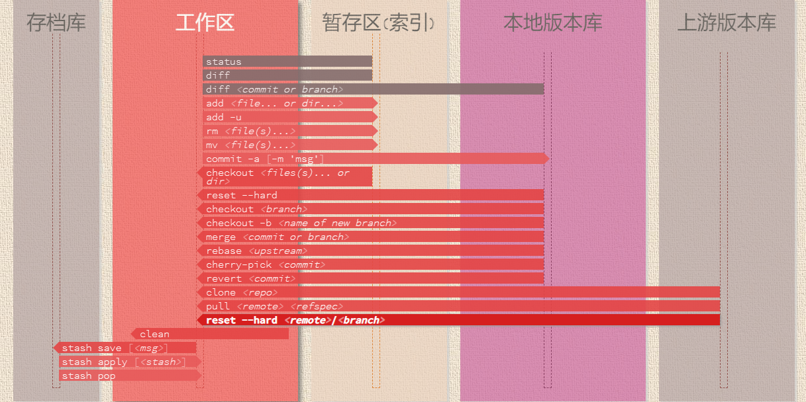
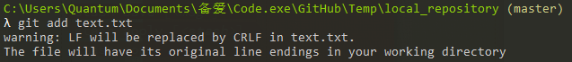
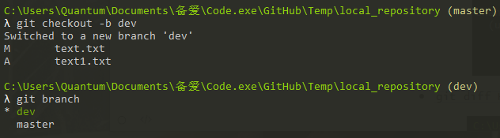
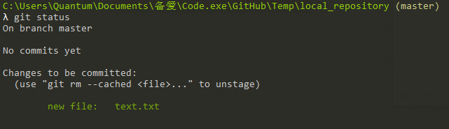
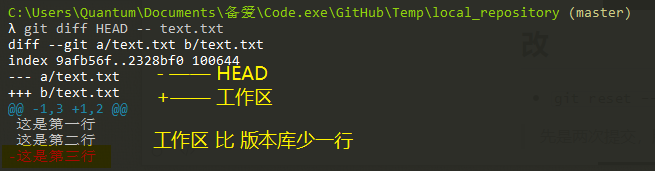
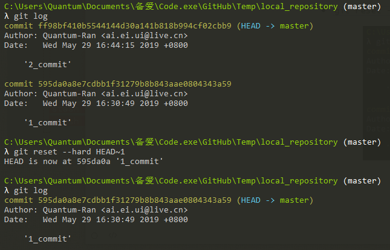
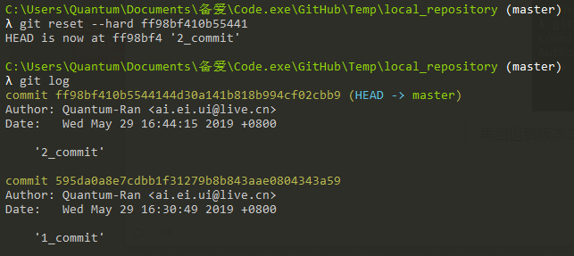
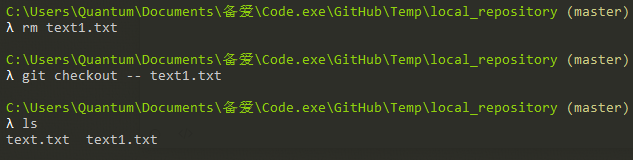
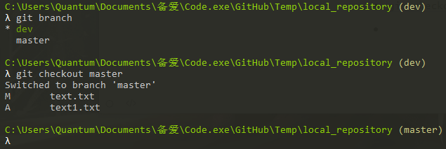
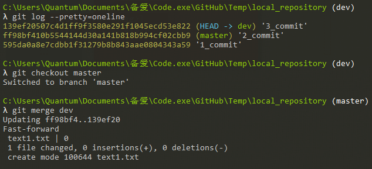

# Workspace

## 增

- `git add 【file…or dir…】`——工作区→暂存区

- `git checkout -b 【branch】`——创建一个新的分支，并切换

## 查

- `git status`——显示状态变化

- `git diff HEAD -- 【file】`——工作区对比版本库内容不同

## 改

- `git reset –-hard HEAD~【版本号】`——版本回退

> 先是两次提交，版本回退到第一版

- `git reset –-hard 【版本id】`——版本切换

> 再回退到版本二

- `git checkout -- 【file】`——丢弃工作区的改动

> 丢弃改动删除的又回来了

- `git checkout 【branch】`——切换分支

## 删

- 

## 合并

- `git merge 【branch】`——快速合并分支*Fast-forward*

