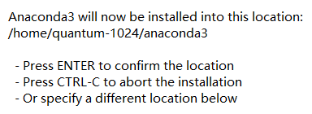

# Anaconda

1. 启动安装

```bash
bash Anaconda3-2019.03-Linux-x86_64.sh
```

2. **提示**安装路径



3. 加入环境变量

```bash
echo 'export PATH="/home/quantun/anaconda3/bin:$PATH"' >> ~/.bashrc

source ~/.bashrc
```

