# 命令

- `docker search 【镜像】`——搜索

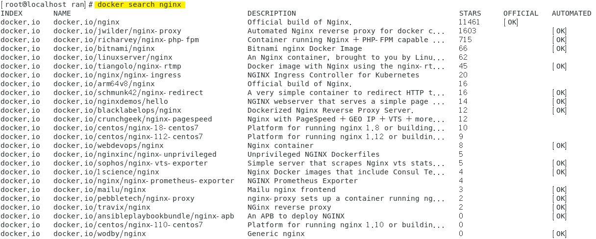

- `docker pull 【镜像】`——下载

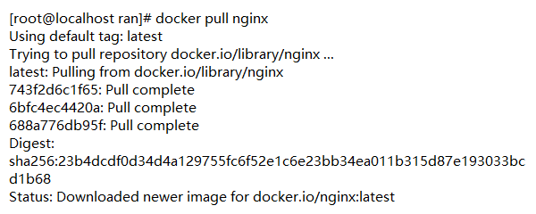

- `docker images`——查看镜像

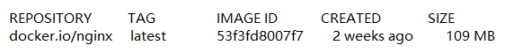

- `docker save 【镜像】 >【路径】`——导出

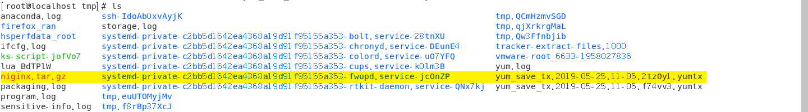

- `docker rmi 【镜像】`——删除

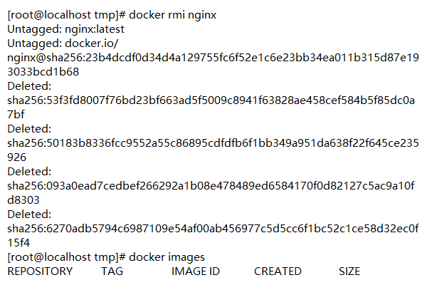

- `docker load <【路径】`——导入

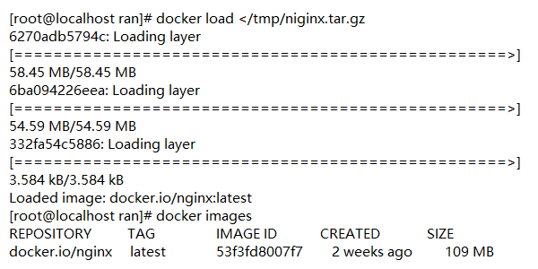

- `docker run -it --name 【容器名】 【镜像】`——镜像启动（create + start）

> -it——持续分配终端
>
> CTRL + p + q——保证在后台运行

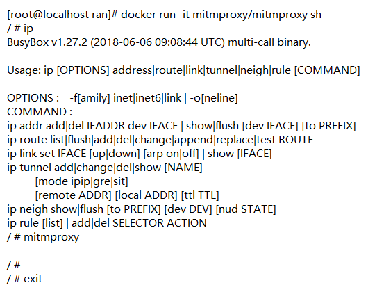

- `docker exec -it 【容器id】 sh `——进到正在启动的容器里，多开，不会对其他用户有影响

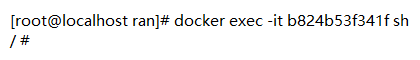

- `docker run -it -d 【镜像】`——后台运行

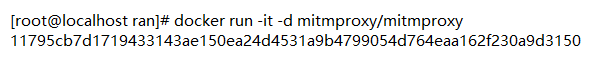

- `docker ps`——查看正在运行的容器

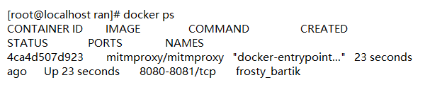

- `docker -f rm 【容器】`——删除容器

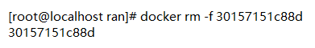

- `docker logs 【容器id】`——查看日志

