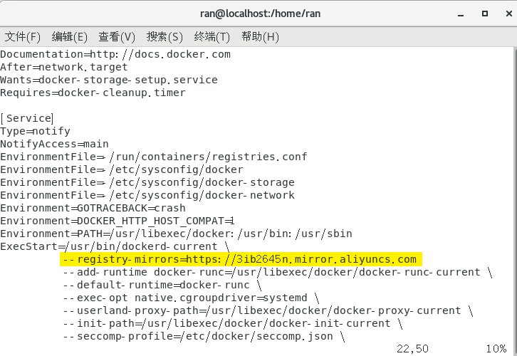

# 安装

1. `su`——切换 root 用户
2. `yum update`——升级 yum
3. `yum install docker -y`——安装 docker
4. `systemctl enable docker`——开机启动
5. <s>`vim /usr/lib/systemd/system/docker.service`——更改 docker 仓库</s>
6. [更换阿里云源](https://cr.console.aliyun.com)

```bash
sudo mkdir -p /etc/docker
sudo tee /etc/docker/daemon.json <<-'EOF'
{
  "registry-mirrors": ["https://3ib2645n.mirror.aliyuncs.com"]
}
EOF
sudo systemctl daemon-reload
sudo systemctl restart docker
```

7. <s>`--registry-mirrors=https://3ib2645n.mirror.aliyuncs.com`</s>



