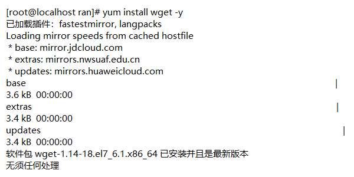
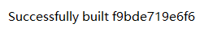
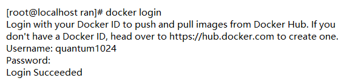

# 镜像制作

1. `yum install wget -y`



2. `echo > Dockerfile`——自动化文件

3. `vim Dockerfile`——写Dockerfile文件

[eple](<https://opsx.alibaba.com/mirror>)——https://mirrors.aliyun.com/epel/epel-release-latest-7.noarch.rpm

## Dockerfile

```dockerfile
# This is Dockerfile for nginx

# 基于那个镜像
From centos

# 维护者信息
MAINTAINER leo

# 相关操作
RUN rpm -ivh https://mirrors.aliyun.com/epel/epel-release-latest-7.noarch.rpm
Run yum install nginx -y

# 添加文件
ADD index.html /usr/share/nginx/html/index.html

# 参数
RUN echo "daemon off;" >>/etc/nginx/ngnix.conf

# 设置开放端口
EXPOSE 80

# 执行命令
CMD ["nginx"]
```

4. `docker build -t 【镜像:版本】 【路径】` ——提交

`docker build -t docker.io/quantum1024/nginx:V1 /home/ran/Docker`




1. docker login ——登录 dockerhub



2. docker images ——获取制作镜像的 id

3. docker tag 【id】 docker.io/quantum1024/mynginx
4. docker push docker.io/quantum1024/mynginx

