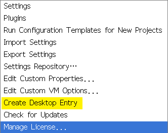
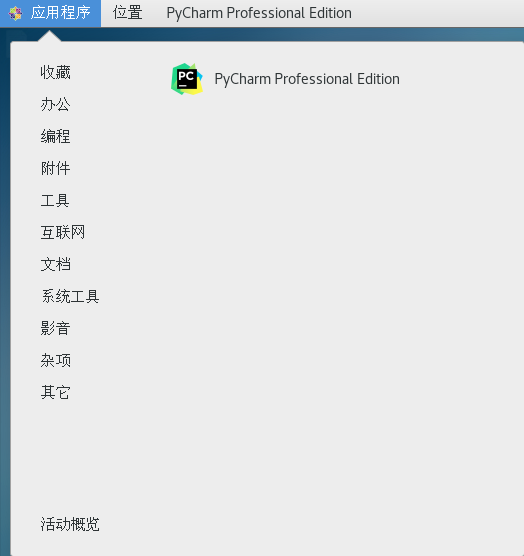

# Pycharm

1. 右键安装包，点击 Extract Here

2. 解压tar.gz

```bash
tar -xf pycharm-professional-2019.1.2.tar.gz 
```

   

3. 安装

```bash
cd bin/

sh ./pycharm.sh
```

3. 新建桌面快捷键





4. 模板

```python
# -*- coding: utf-8 -*-
# @Time : ${DATE} ${TIME}
# @Author : Quantum-Ran
# @Email : ai.ei.ui@live.cn
# @File : ${NAME}.py
# @Software: ${PRODUCT_NAME}
```

