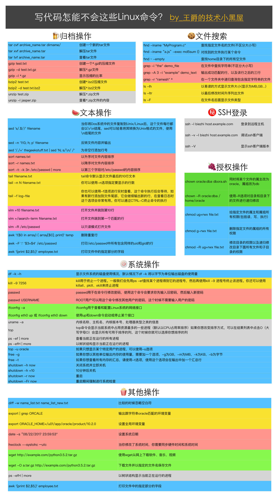

# 系统目录&基本命令

virtual$_{乌尔·处嗷}$ machine


## 系统目录

### /bin

可执行的二进制文件

### /dev

设备文件

### /etc

系统配置文件

### /home

用户文件

## 常用基本命令

==真正的管理服务器是通过SSH客户端从远程管理，因为现场不适合长期工作。==

#### ls $\rightleftharpoons$ list

查看文件夹下的内容

#### pwd $\rightleftharpoons$ print work directory

查看当前所在文件夹

#### cd `directoryName` $\rightleftharpoons$ change directory

切换文件夹

#### mkdir `directoryName` $\rightleftharpoons$ make directory

新建目录

##### [-p]

可以递归创建目录

#### touch `fileName`

新建文件

#### rm `fileName`$\rightleftharpoons$ remove

删除文件

##### [-f]

强制

##### [-r]

递归多级目录

## 命令终端格式

```
command [-options] [parameter]
```

