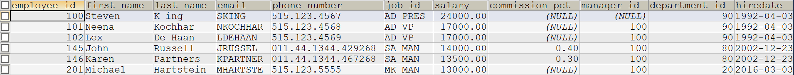
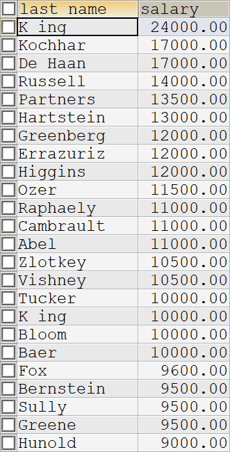

# select

## 基础

- 查询列表——字段以逗号隔开

```mysql
select 【查询列表】
from 【表名】; 
```

```mysql
SELECT first_name,last_name
FROM employees;
```


- 起别名——加双引是因为有可能有特殊字符

```mysql
select 【字段】 as "【别名】"
```

```mysql
SELECT first_name AS "名",last_name AS "姓"
FROM employees;
```


- 去重——distinct

```mysql
select distinct 【字段】
from 【表名】; 
```

```mysql
SELECT DISTINCT department_id
FROM employees;
```


- +——运算符

```mysql
select 【字段1+字段2】;
```

```mysql
select 100+99; # 199
select '100'+99; # 199
select 'join'+99; # 0
select null+99; # null
```

- `ifnull()`——如果是 null

```mysql
select ifnull(【字段】,【替代值】),【字段】
```

```mysql
SELECT IFNULL(commission_pct,0) AS "奖金率",commission_pct
FROM employees;
```


- `concat()`——拼接

```mysql
select concat(【字段1, 字段2】);
```

```mysql
SELECT CONCAT(last_name,first_name) AS "姓名"
FROM employees;
```


## 条件查询

```mysql
select 【查询列表】 
from 【表】
where 【筛选条件】;
```

- 条件表达式——`>`;`<`;`=`;`<>`;`>=`;`<=`

```mysql
# 工资>12000的员工信息
SELECT *
FROM employees
WHERE salary>12000;
```



```mysql
# 查询部门编号不等于90号的员工名和部门编号
SELECT first_name,department_id
FROM employees
WHERE department_id<>90;
```


- 逻辑表达式——`and`;`or`;`not`

```mysql
# 工资在10000至20000之间的员工名、工资、奖金
SELECT first_name,salary,commission_pct
FROM employees
WHERE salary 
      BETWEEN 10000 
      AND 20000;
```


```mysql
# 查询部门编号不是在90到110之间，或者工资高于15000的员工的信息
SELECT first_name,department_id,salary
FROM employees
WHERE NOT (department_id BETWEEN 90 AND 110) 
      OR salary>15000;
```


- 模糊查询——`like`;`between and`;`in`;`in null`

- `%`——任意多个字符，包含 0 个

```mysql
# 员工名中包含 a 的员工
SELECT last_name
FROM employees
WHERE last_name LIKE "%a%";
```


- `_`——任意一个字符

```mysql
# 员工名中第三个字符为 n ,第五个字符为 l 的员工名和工资
SELECT last_name,salary
FROM employees
WHERE last_name LIKE "__n_l%";
```


```mysql
# 员工名中第二个字符为_的员工名
SELECT last_name,salary
FROM employees
WHERE last_name LIKE "_\_%";
```


- `between and`——>= and <=

- `in ("","")`——是否属于，满足一项即可，*类型要统一，不支持通配符*

```mysql
# 员工的工种编号 it_prog, ad_vp, ad_pres 的员工名
SELECT last_name,job_id
FROM employees
WHERE job_id IN ("it_prog","ad_vp","ad_pres");
```


- `is null`——判断 null 值用 is

```mysql
# 没有奖金的员工名和奖金率
SELECT last_name,commission_pct
FROM employees
WHERE commission_pct IS NULL;
```


```mysql
# 有奖金的员工名和奖金率
SELECT last_name,commission_pct
FROM employees
WHERE commission_pct IS NOT NULL;
```


- `<=>`——安全等于 *可以判断 null*

<ol>
    <li><a href='测试1'>测试1</a></li>
</ol>

## 排序查询

```mysql
select 【查询条件】
from 【表】
where 【筛选条件】
order by 【排序列表】
【desc|asc】;
```

- 没有筛选不用 where

```mysql
# 员工工资从高到底排序
SELECT last_name,salary
FROM employees
ORDER BY salary DESC;
```



- 包含筛选字段

```mysql
# 部门编号>=90的员工信息，按入职时间的先后进行
SELECT last_name,department_id,hiredate
FROM employees
WHERE department_id>=90
ORDER BY hiredate;
```


- 按表达式排序

```mysql
# 按年薪的高低显示员工的信息和年薪 按年薪排序
SELECT *,salary*12*(1*IFNULL(commission_pct,1)) AS "年薪"
FROM employees
ORDER BY "年薪" DESC;
```


- 按函数排序

```mysql
# 按姓名的长度显示员工的工资
SELECT last_name,salary
FROM employees
ORDER BY LENGTH(last_name);
```


- 多个字段排序

```mysql
# 员工先按工资排序，再按员工编号降序排序
SELECT last_name,salary,employee_id
FROM employees
ORDER BY salary,employee_id DESC;
```


## 常见函数

```mysql
select 【查询条件】
【function(实参)】
from 【表】;
```

### 单行函数——处理

1. 字符函数

- `length()`——字节个数

- `concat()`——拼接

- `upper()`——大写

- `lower()`——小写

- `substr(【string】,【start】,【length】)`——截取

- `instr()`——起始索引

- `trim()`——去空格

- `lpad()`——左填充

- `rpad()`——右填充

- `replace(【string】,【old】,【new】)`——替换

2. 数学函数

- `round()`——四舍五入

- `ceil()`——向上取整

- `floor()`——向下取整

- `tauncate()`——截断

- `mod()`——取余

3. 日期函数

- `now()`——返回当前日期

- `year(now())`——年份的日期

```mysql
SELECT YEAR(hiredate) AS "年"
FROM employees;
```


- `str_to_date()`——字符串转日期

```mysql
# 员工入职日期为"4-3 1992"的员工
SELECT last_name,hiredate
FROM employees
WHERE hiredate = STR_TO_DATE("4-3 1992","%c-%d %Y");
```


- `datediff(【datepart】,【start】,【end】)`——时间差

5. 流程控制函数

- `if(【条件表达式】,"【条件成立返回】","【条件不成立返回】")`——类似三目运算符

```mysql
SELECT last_name,commission_pct,
IF(commission_pct IS NULL,"没奖金","有奖金") AS "备注"
FROM employees;
```


- `case()`——类似 switch

```mysql
case 【要判断的字段或表达式】
when 【常量1】 then 【要显示的值或语句】
when 【常量2】 then 【要显示的值或语句】
else 【默认语句】
end
```

```mysql
# 部门号=30，显示原工资的1.1
# 部门号=40，显示原工资的1.2
# 部门号=50，显示原工资的1.3
# 其他，显示原工资
SELECT salary AS "原工资",department_id,
CASE department_id
WHEN 30 THEN salary*1.1
WHEN 40 THEN salary*1.2
WHEN 50 THEN salary*1.3
ELSE salary
END AS "新工资"
FROM employees;
```


```mysql
SELECT NOW();

SELECT employee_id,last_name,salary*1.2 AS "new salary"
FROM employees;

SELECT SUBSTR(last_name,1,1) AS "首字母",LENGTH(last_name) AS "名字长度"
FROM employees
ORDER BY "首字母";

SELECT CONCAT(last_name," earns ",salary," monthly but wants ",salary*3)
FROM employees;

SELECT last_name,job_id AS "Job",
CASE job_id
WHEN "AD_PRES" THEN "A"
WHEN "ST_MAN" THEN "B"
WHEN "IT_PROG" THEN "C"
WHEN "SA_REP" THEN "D"
WHEN "ST_CLERK" THEN "E"
END AS Grade
FROM employees;
```

### 分组函数——统计

- `sum()`

- `avg()`

- `count()`

- `max()`

- `min()`

**和分组函数查询的字段要求是 group by 后的字段**


```mysql
SELECT MAX(salary),MIN(salary),AVG(salary),SUM(salary)
FROM employees;

SELECT DATEDIFF(MAX(hiredate),MIN(hiredate)) AS "DIFFRENCE"
FROM employees;

SELECT COUNT(*) AS "个数"
FROM employees
WHERE department_id=90;
```

- `group by`——分组查询

```mysql
# 每个工种的最高工资
SELECT MAX(salary),job_id
FROM employees
GROUP BY job_id;
```


```mysql
# 每个位置上的部门个数
SELECT COUNT(*),location_id
FROM departments
GROUP BY location_id;
```


```mysql
# 邮箱中包含 a 字符的，每个部门的平均工资
SELECT AVG(salary),department_id
FROM employees
WHERE email LIKE "%a%"
GROUP BY department_id;
```


```mysql
# 有奖金的每个领导手下的员工的最高工资
SELECT MAX(salary),manager_id
FROM employees
WHERE commission_pct IS NOT NULL
GROUP BY manager_id;
```


- having——分组后的结果集筛选

```mysql
# 那个部门员工个数>2
# 1
SELECT COUNT(*) AS "员工数",department_id
FROM employees
GROUP BY department_id
# 2根据结果集查询
HAVING COUNT(*)>2;
```


```mysql
# 每个工种有奖金的员工的最高工资>12000的工种编号和最高工资
SELECT MAX(salary) AS "最高工资",job_id AS "工种编号"
FROM employees
WHERE commission_pct IS NOT NULL
GROUP BY job_id
HAVING MAX(salary)>12000;
```


```mysql
# 领导编号>102的每个手下的最低工资>5000的领导编号是哪个
SELECT MIN(salary),manager_id AS "领导编号"
FROM employees
WHERE manager_id>102
GROUP BY manager_id
HAVING MIN(salary)>5000;
```


- 按函数分组

```mysql
# 按员工姓名的长度分组，每个组员工个数，筛选员工个数>5的有哪些
SELECT COUNT(*),LENGTH(last_name) AS "姓名"
FROM employees
GROUP BY LENGTH(last_name)
HAVING COUNT(*)>5;
```


- 按多个字段分组

```mysql
# 每个部门每个工种的员工的员工的平均工资
SELECT AVG(salary),department_id,job_id
FROM employees
GROUP BY department_id,job_id;
```


```mysql
SELECT MAX(salary),MIN(salary),AVG(salary),SUM(salary)
FROM employees
GROUP BY job_id
ORDER BY job_id;

SELECT MAX(salary)-MIN(salary) as DIFFERENCE
FROM employees;

SELECT MIN(salary)，manager_id
FROM employees
WHERE manager_id IS NOT NULL
GROUP BY manager_id
HAVING MIN(salary)>6000;

SELECT department_id,COUNT(*),AVG(salary)
FROM employees
GROUP BY department_id
ORDER BY AVG(salary) DESC;

SELECT COUNT(*) AS "个数",job_id
FROM employees
GROUP BY job_id;
```

