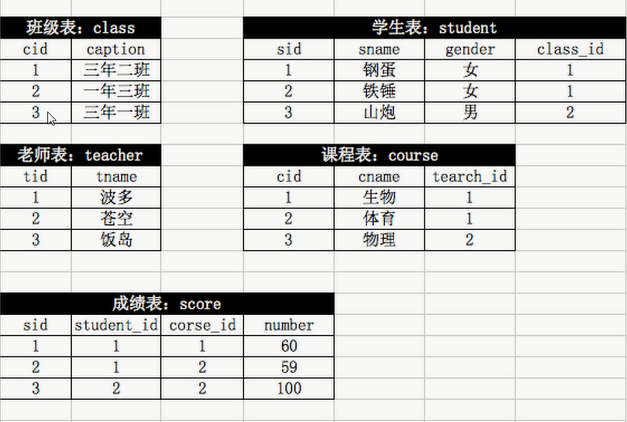

# 约束

- `null`——可以为空
- `defualt 【值】`——默认值
- `auto_increment`——自增，**必须是主键**，唯一
- `primary key`——主键，不能为空，不能重复，加速查找，唯一
  - 主键可以多列

## 外键

```mysql
constraint 【外键名】 foreign key(【本字段】,) references 【外表】(【外表字段】)
```



```mysql
create database school charset utf8;
use school;
create table class(
    cid int auto_increment primary key,
    caption varchar(10)
)engine=innodb default charset=utf8;
```

```mysql
create table teacher(
    tid int auto_increment primary key,
    tname varchar(10)
)engine=innodb default charset=utf8;
```

```mysql
create table student(
    sid int auto_increment primary key,
    sname varchar(10),
    gender enum('男','女'),
    class_id int,
    constraint s_c foreign key(class_id) references class(cid)
)engine=innodb default charset=utf8;
```

```mysql
create table course(
    cid int auto_increment primary key,
    cname varchar(10),
    teacher_id int,
    constraint c_t foreign key(teacher_id) references teacher(tid)
)engine=innodb default charset=utf8;
```


```mysql
create table score(
	sid int auto_increment primary key,
    student_id int,
    course_id int,
    constraint score_student foreign key(student_id) references student(sid),
    constraint score_course foreign key(course_id) references course(cid),
    number int
)engine=innodb default charset=utf8;
```

- 外键名不能重复

1. 自行创建测试数据

```mysql

```

