# 生成 ndarray

n 维数组

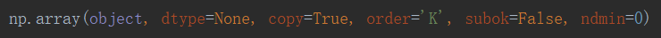

- object——**数组**或嵌套的**数列**

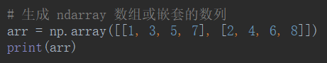

- dtype——数组元素的数据类型，可选

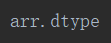

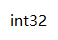

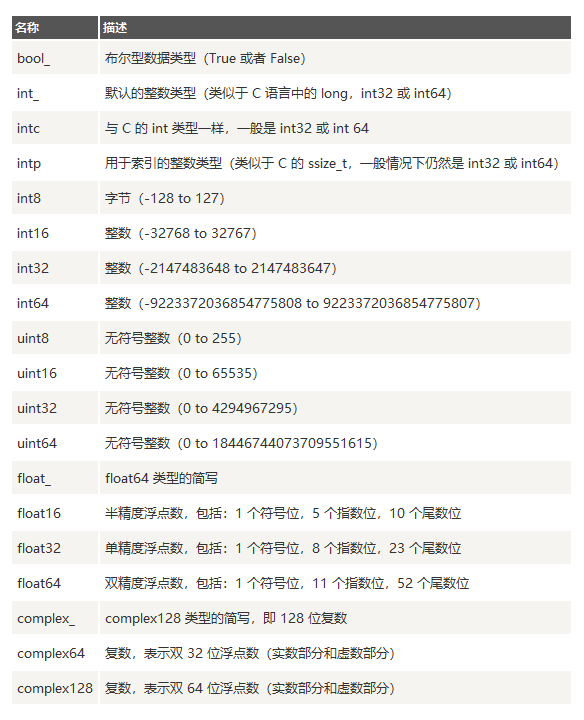

- copy——对象是否需要复制，可选

- order——创建数组的样式，C为行方向，F为列方向，A为任意方向（默认）

- subok——默认返回一个与基类类型一致的数组

- ndmin——指定生成数组的最小维度

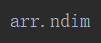

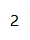

`ndarray.shape`——数组的维度，对于矩阵，n 行 m 列

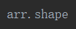

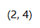

`ndarray.size`——数组元素的总个数，相当于 .shape 中 n*m 的值

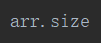

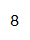

## 生成函数

`ny.zeros(【ndarray.shape】)`——全 0 数组

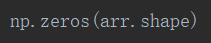

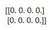

`ny.ones(【ndarray.shape】)`——全 1 数组

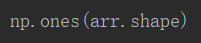

`ny.full(【ndarray.shape】【fill_value】)`——全 n 数组

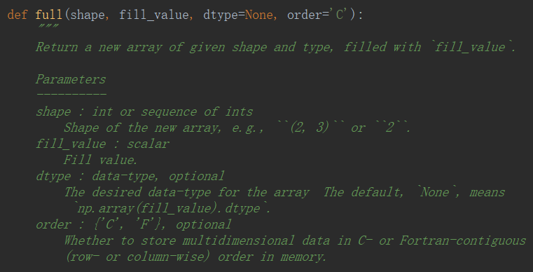

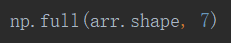

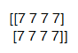

`ny.eye(【ndarray.shape】)`——对角线都是 1，其他都是 0

- n——返回矩阵的行数
- M——返回矩阵的列数，默认为 n
- k——对角线的索引
- dtype——数据类型

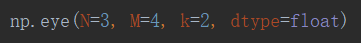

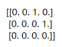

`np.astype(【数字类型】)`——转换数组的数据类型

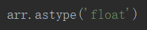

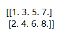

