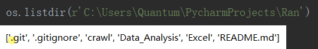
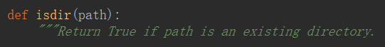

# OS

## 目录

### 增

`os.makedirs()`——递归生成目录

Recursive——递归

### 删

`os.removedirs()`——若目录为空，则删除。递归到上一级目录，如果也为空则删除

### 改

`os.chdir()`——改变当前**脚本**的工作目录

### 查

`os.getcwd()`——获取当前工作目录

## 文件

### 删

`os.remove()`——删除文件

### 改

`os.rename()`——重命名**文件**or**目录**

### 查

`os.stat('path/filename')`——获取**文件**or**目录**信息

`os.listdir()`——列出指定目录下的所有**文件**和**子目录**，包括**隐藏文件**，用**列表**方式打印

## 路径

### 绝对路径和相对路径

`os.path.abspath()`——返回绝对路径

`os.path.isabs()`——判断是否是绝对路径

`os.path.relpath()`——返回关于当前**游标**所在的目录相对路径

relative——相对的

### 目录名称和基本名称

`os.path.dirname()`——**目录名称**是最后 一个斜杠之前的所有内容

`os.path.basename()`——**基本名称**跟在路径中最后一个斜杠后，它和文件名一样

`os.path.split()`——可以调用`os. path. dirname()`和`os. path. basename()`， 将它们的返回值放在一个元组中，从而 得到同样的元组

### 文件大小

`os.path.getsize()`——获取文件的字节数。

### 检查有效性

`os.path.exists()`——判断是否存在

`os.path.isfile()`——判断是否是一个文件

`os.path.isdir()`——判断是否是一个目录

### 拼接路径

`os.path.join(path1[, path2[, ...]])`——将多个路径组合返回

`os.walk(root, dirs, files)`——方法是一个简单易用的文件、目录遍历器，可以帮助我们高效的处理文件、目录方面的事情。

- root 所指的是当前正在遍历的这个文件夹的本身的地址
- dirs 是一个 list ，内容是该文件夹中所有的目录的名字(不包括子目录)
- files 同样是 list , 内容是该文件夹中所有的文件(不包括子目录)

