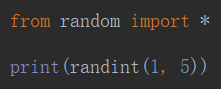
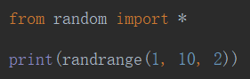
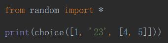
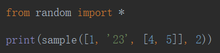
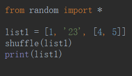

# Random

## 随机整数

- `random.randint()`——随机 5 >= x >= 1




- `random.randrange()`——随机 9，7，5，3，1——如果不设置**步长**，和`randint`一样




## 从一个数据集合里（可以不同类型）随机抽取一个对象

- `random.choice([])`——随机选择**一个**




- `random.sample([])`——随即返回**多个**




## 打乱顺序

- `random.shuffle([])`——随机打乱顺序，**直接改变元数据**




## 例子

### 验证码

```python
import random


def yzhm():
    r = ''
    for i in range(6):
        r1 = random.randint(65, 90)  # 数字转字母
        r2 = random.randint(0, 9)
        ret = random.choice([chr(r1), str(r2)])
        r += ret
    return r


print(yzhm())

```

### 随机user-agent

