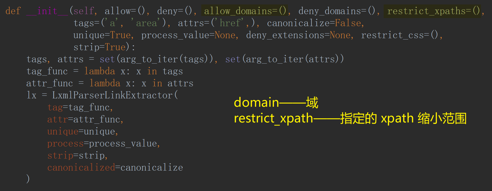
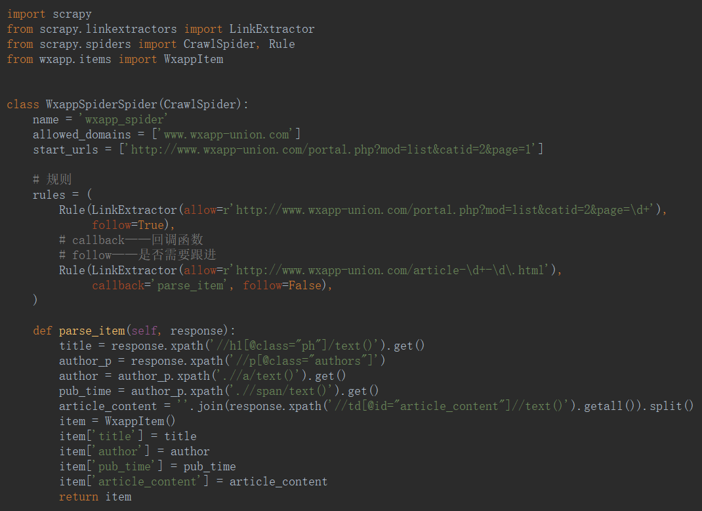
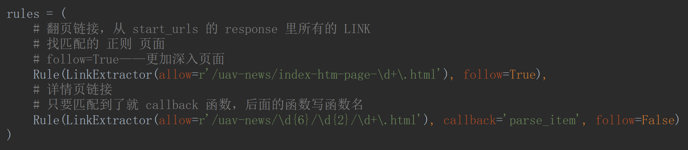
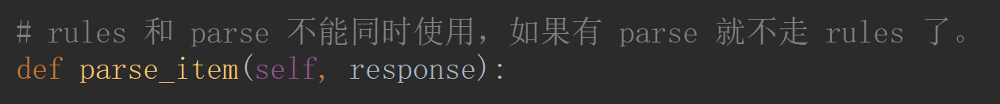
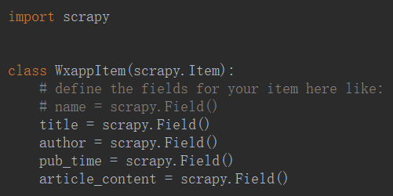
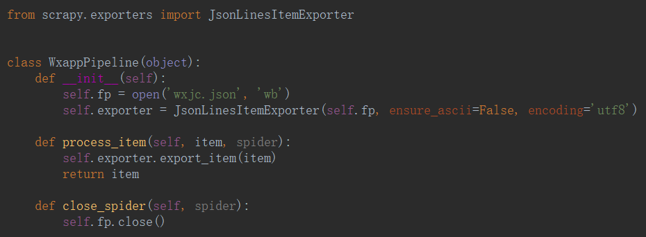
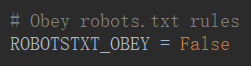
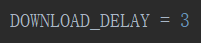
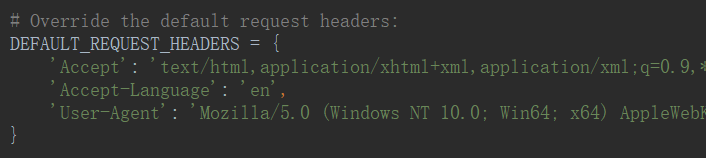
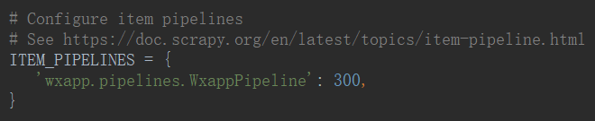

# CrawlSpider

- \_\_init\_\_

# Project

- spiders

<ul>
    <li>
        <a href='ItemLoader'>ItemLoader</a>
    </li>
</ul>

- item

- pipelines

- settings

## eg.

<a href='wxapp'>wxapp</a>

